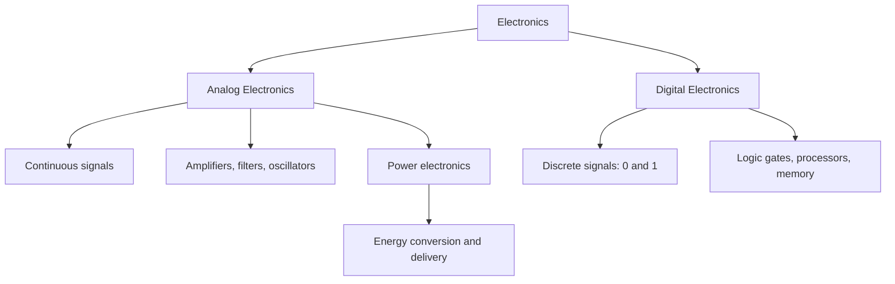
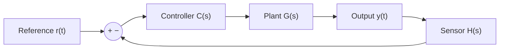
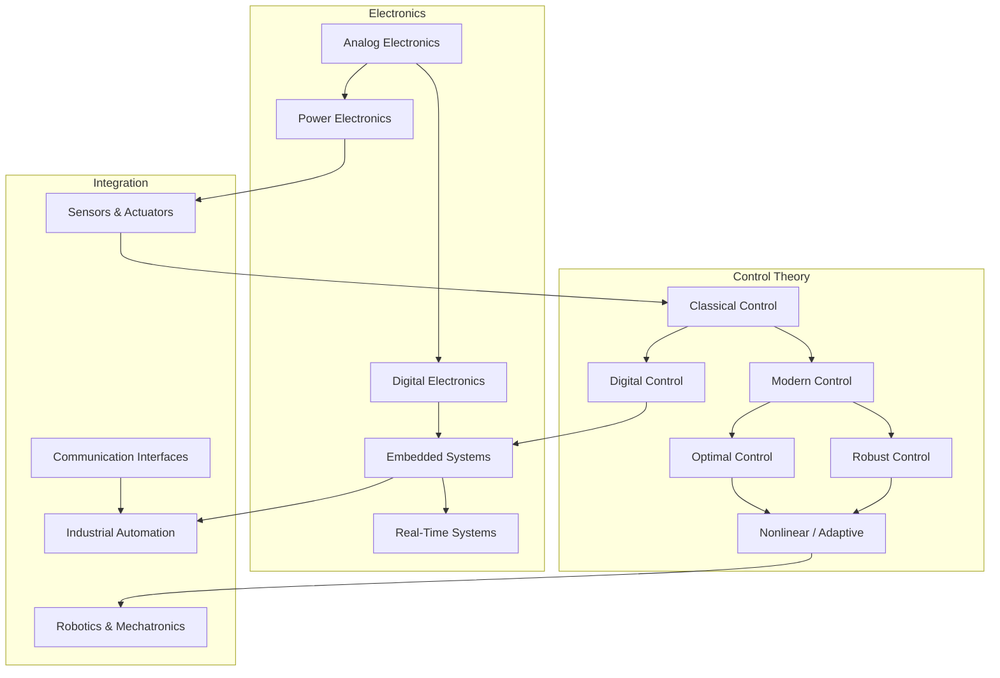

# 01 — Foundations: What Are Control Systems & Electronics?

> *Before you can control a system, you must understand what a system is — and before you can design electronics, you must understand what electrons actually do in circuits.*

---

## 1.1 What Is a Control System?

A **control system** is any arrangement of components that commands, directs, or regulates the behavior of another system (or itself) to achieve a desired objective.

### The Core Idea

Every control system answers one question:

> **"How do I make the actual output match the desired output, despite disturbances, noise, and uncertainty?"**

```
              ┌─────────────┐
  Desired ──►│  Controller  ├──► Actuator ──► Plant ──► Output
  Output     └──────┬───────┘                    │
                     │                            │
                     └──── Sensor ◄───────────────┘
                         (feedback)
```

**Key terms:**
- **Plant**: The physical system being controlled (a motor, a chemical reactor, an aircraft)
- **Controller**: The decision-making element (analog circuit, digital algorithm, human operator)
- **Actuator**: Converts the controller's decision into physical action (motor, valve, heater)
- **Sensor**: Measures the actual output (encoder, thermocouple, accelerometer)
- **Feedback**: The return path that informs the controller about the current state

### Why Control Systems Matter

Control systems are everywhere:

| Domain | Example | What's Controlled |
|---|---|---|
| Automotive | Cruise control | Vehicle speed |
| Aerospace | Autopilot | Aircraft attitude and altitude |
| Manufacturing | CNC machine | Tool position |
| HVAC | Thermostat | Room temperature |
| Biology | Homeostasis | Body temperature, blood sugar |
| Power grid | Governor | Generator frequency |

---

## 1.2 What Is Electronics?

Electronics is the branch of physics and engineering that deals with the **controlled flow of electrons** through materials (conductors, semiconductors, insulators) to process information or deliver energy.

### Two Fundamental Branches



| Branch | Signal Type | Key Concern | Example |
|---|---|---|---|
| Analog | Continuous | Signal fidelity, noise | Audio amplifier |
| Digital | Discrete (binary) | Timing, logic correctness | Microprocessor |
| Power | High energy | Efficiency, thermal management | Motor drive |

---

## 1.3 Historical Context

Understanding history reveals *why* control and electronics developed the way they did.

### Control Systems Timeline

| Era | Milestone | Significance |
|---|---|---|
| ~270 BC | Ctesibius water clock | First known feedback mechanism |
| 1788 | Watt's centrifugal governor | Automatic speed regulation for steam engines |
| 1868 | Maxwell's governor analysis | First mathematical treatment of stability |
| 1932 | Nyquist stability criterion | Frequency-domain analysis born |
| 1945 | Bode's feedback amplifier theory | Systematic frequency-domain design |
| 1960 | Kalman's state-space theory | Modern control theory begins |
| 1960s | Optimal control (LQR, Pontryagin) | Performance-driven design |
| 1980s | Robust control (H∞) | Dealing with uncertainty systematically |
| 2000s+ | MPC, adaptive, AI-based control | Real-time optimization, learning |

### Electronics Timeline

| Era | Milestone | Significance |
|---|---|---|
| 1904 | Vacuum tube (Fleming) | First electronic amplification |
| 1947 | Transistor (Bell Labs) | Solid-state revolution |
| 1958 | Integrated circuit (Kilby/Noyce) | Miniaturization begins |
| 1971 | Microprocessor (Intel 4004) | Computing on a chip |
| 1980s+ | VLSI, FPGA | Billions of transistors; reconfigurable logic |
| 2000s+ | SoC, IoT, GaN/SiC power devices | System-level integration, wide-bandgap semiconductors |

💡 **Insight**: Control theory and electronics co-evolved. Better sensors and faster processors enabled more sophisticated control algorithms, which in turn demanded better electronics.

---

## 1.4 Open-Loop vs. Closed-Loop Systems

This is the single most important conceptual distinction in control systems.

### Open-Loop System

An open-loop system applies a **pre-determined input** without measuring the output.

```
  Reference ──► Controller ──► Actuator ──► Plant ──► Output
  (desired)                                          (no feedback)
```

**Example**: A toaster with a timer. You set 3 minutes. It doesn't measure toast color.

**Characteristics:**
- Simple, cheap
- No sensor needed
- Cannot compensate for disturbances
- Accuracy depends entirely on calibration
- Unstable systems cannot be stabilized open-loop

### Closed-Loop (Feedback) System

A closed-loop system **measures the output** and uses the **error** (difference between desired and actual) to adjust the input.



**Example**: A thermostat-controlled heater. It measures temperature and turns the heater on/off.

**Characteristics:**
- Can reject disturbances
- Reduces sensitivity to plant parameter changes
- Can stabilize inherently unstable systems
- More complex, requires sensors
- Can become unstable if poorly designed (!)

### Mathematical Comparison

For an open-loop system with controller $C(s)$ and plant $G(s)$:

$$Y(s) = C(s) \cdot G(s) \cdot R(s)$$

For a closed-loop system with unity feedback:

$$Y(s) = \frac{C(s) \cdot G(s)}{1 + C(s) \cdot G(s)} \cdot R(s)$$

The denominator $1 + C(s)G(s)$ is the **characteristic polynomial** — its roots determine stability.

⚠️ **Pitfall**: "Closed-loop is always better" is **false**. If the feedback signal is too noisy or delayed, closing the loop can make things worse. The advantage of feedback comes with the responsibility of stability analysis.

---

## 1.5 Abstraction and Block Diagrams

Engineers manage complexity through **abstraction** — hiding internal details behind well-defined interfaces.

### Levels of Abstraction

```
  Level 5: System     │  "Autonomous vehicle maintains lane"
  Level 4: Subsystem  │  "Steering controller adjusts wheel angle"
  Level 3: Component  │  "Motor driver amplifies control signal"
  Level 2: Circuit    │  "H-bridge switches MOSFET pairs"
  Level 1: Device     │  "MOSFET conducts when Vgs > Vth"
  Level 0: Physics    │  "Electrons flow through channel"
```

### Block Diagram Algebra

Block diagrams are the **lingua franca** of control engineering. They represent signal flow without specifying physical implementation.

**Fundamental operations:**

```
  Series (cascade):       G₁(s) ──► G₂(s)  =  G₁(s) · G₂(s)

  Parallel:               ┌─ G₁(s) ─┐
                     ──►──┤          ├──►──  =  G₁(s) + G₂(s)
                          └─ G₂(s) ─┘

  Negative Feedback:      R ──►(+)──► G(s) ──► Y
                               (-)◄── H(s) ◄──┘
                                                     G(s)
                          Transfer function = ─────────────────
                                              1 + G(s)·H(s)
```

### Block Diagram Reduction Rules

| Rule | Original | Equivalent |
|---|---|---|
| Cascade | $G_1 \to G_2$ | $G_1 G_2$ |
| Parallel | $G_1 \parallel G_2$ | $G_1 + G_2$ |
| Negative feedback | $G$ with feedback $H$ | $\frac{G}{1+GH}$ |
| Positive feedback | $G$ with feedback $H$ | $\frac{G}{1-GH}$ |
| Moving pickoff before block | After $G$ → Before $G$ | Multiply branch by $G$ |
| Moving summing point after block | Before $G$ → After $G$ | Divide branch by $G$ |

---

## 1.6 Physical Intuition and Modeling Assumptions

### The Modeling Hierarchy

Real physical systems are infinitely complex. We model them by making **deliberate simplifying assumptions**.

```
  Real System
      │
      ▼
  Physical Model (idealized: rigid bodies, lumped parameters)
      │
      ▼
  Mathematical Model (differential equations)
      │
      ▼
  Transfer Function / State-Space Model
      │
      ▼
  Simulation / Controller Design
```

### Common Modeling Assumptions

| Assumption | What It Means | When It Breaks |
|---|---|---|
| **Linearity** | Output is proportional to input | Saturation, dead zones, friction |
| **Time-invariance** | Parameters don't change over time | Aging, temperature drift, wear |
| **Lumped parameters** | No spatial variation within a component | High frequencies, distributed systems |
| **Rigid bodies** | No deformation | Flexible structures, vibrations |
| **Ideal sensors** | Perfect, instantaneous measurement | Noise, delay, quantization |
| **No parasitic effects** | Wires have zero resistance, capacitors are ideal | High-frequency circuits, PCB layout |

💡 **Insight**: Every model is wrong. The question is whether the model is *useful enough* for your purpose. A model that captures the dominant dynamics at your frequency of interest is a good model.

🔧 **Practical**: In industry, you often start with a simple model, design a controller, test it, then refine the model based on what went wrong. This iterative loop is the reality of engineering practice.

---

## 1.7 Analogies Between Physical Domains

One of the most powerful ideas in systems engineering: **different physical domains obey mathematically identical equations**.

| Concept | Mechanical (Translation) | Electrical | Thermal | Fluid |
|---|---|---|---|---|
| **Through variable** (flow) | Force $F$ | Current $i$ | Heat flow $q$ | Flow rate $Q$ |
| **Across variable** (effort) | Velocity $v$ | Voltage $V$ | Temperature $T$ | Pressure $P$ |
| **Resistance** | Damper $b$ | Resistor $R$ | Thermal resistance $R_{th}$ | Fluid resistance $R_f$ |
| **Capacitance** (storage) | Spring $1/k$ | Capacitor $C$ | Thermal capacitance $C_{th}$ | Tank $C_f$ |
| **Inertia** (inductance) | Mass $m$ | Inductor $L$ | — | Fluid inertia |

This means: **if you can analyze an RLC circuit, you can analyze a mass-spring-damper system** — the math is the same.

$$m\ddot{x} + b\dot{x} + kx = F(t) \quad \longleftrightarrow \quad L\ddot{q} + R\dot{q} + \frac{1}{C}q = V(t)$$

---

## 1.8 Common Beginner Misconceptions

See the detailed example file: [examples/common-misconceptions.md](examples/common-misconceptions.md)

**Quick summary of the most dangerous misconceptions:**

| # | Misconception | Reality |
|---|---|---|
| 1 | "Feedback always helps" | Feedback with delay or noise can destabilize |
| 2 | "Linear models are useless for nonlinear systems" | Most real controllers are designed with linear models and work fine within operating regions |
| 3 | "Stability means good performance" | A system can be stable but unacceptably slow or oscillatory |
| 4 | "Digital is always better than analog" | Analog can be faster, lower-noise, lower-power for some applications |
| 5 | "More sensors = better control" | Redundant noisy sensors can degrade estimation |
| 6 | "The math doesn't matter in practice" | The math tells you what's possible and what's guaranteed |

---

## 1.9 Section Diagram: The Control & Electronics Landscape



---

## Examples

| File | Description |
|---|---|
| [open-vs-closed-loop.md](examples/open-vs-closed-loop.md) | Detailed comparison with a temperature control case study |
| [block-diagram-basics.md](examples/block-diagram-basics.md) | Step-by-step block diagram reduction |
| [common-misconceptions.md](examples/common-misconceptions.md) | Anti-patterns and corrections for beginners |

---

**Next section → [02-mathematical-modeling/README.md](../02-mathematical-modeling/README.md)**
