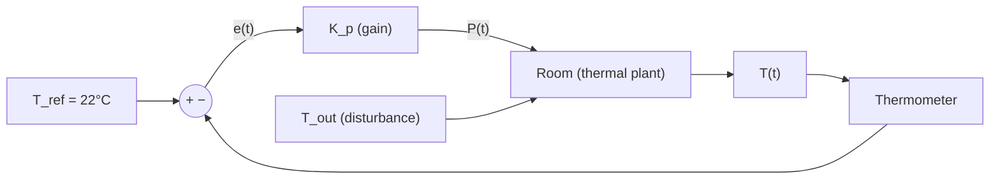

# Example: Open-Loop vs. Closed-Loop — Temperature Control Case Study

## Purpose

Demonstrate the fundamental difference between open-loop and closed-loop control using a concrete, physically intuitive example: heating a room to a target temperature.

---

## Scenario

You have:
- A room with thermal capacitance $C_{th}$ and thermal resistance to the outside $R_{th}$
- A heater with power output $P$ (Watts)
- Outside temperature $T_{out}$ (a disturbance)
- Desired room temperature: $T_{ref} = 22°C$

### Thermal Model

The room temperature $T(t)$ obeys:

$$C_{th} \frac{dT}{dt} = P(t) - \frac{T(t) - T_{out}}{R_{th}}$$

This is a first-order linear ODE — the simplest possible thermal model.

---

## Open-Loop Approach

### Strategy
Calculate the heater power needed to achieve $T_{ref}$ at steady state, then apply that power constantly.

### Steady-State Calculation

At steady state, $\frac{dT}{dt} = 0$:

$$0 = P_{ss} - \frac{T_{ref} - T_{out}}{R_{th}}$$

$$P_{ss} = \frac{T_{ref} - T_{out}}{R_{th}}$$

### What Goes Wrong

```
  Scenario: T_out drops from 5°C to -5°C (cold front)
  
  Original: P_ss = (22 - 5) / R_th = 17/R_th
  Needed:   P_ss = (22 - (-5)) / R_th = 27/R_th
  
  Result: Room cools below 22°C because heater power is fixed.
  
  Temperature
  24 │         _______________
  22 │────────/               \
  20 │                         \________  ← actual (open-loop)
  18 │                                    
  16 │                                    ← T_out dropped
     └────────────────────────────────── Time
              Cold front arrives
```

**Problems:**
1. Cannot compensate for changing $T_{out}$
2. Cannot compensate for opening a window (change in $R_{th}$)
3. Cannot compensate for model errors (wrong $C_{th}$ or $R_{th}$ values)

---

## Closed-Loop Approach (Thermostat)

### Strategy
Measure $T(t)$, compute error $e(t) = T_{ref} - T(t)$, and adjust heater power proportionally.

### Simple Proportional Controller

$$P(t) = K_p \cdot e(t) = K_p \cdot (T_{ref} - T(t))$$

### Block Diagram



### What Happens Now

```
  Temperature
  24 │              ╱‾‾‾‾‾‾‾‾‾‾‾‾
  22 │─────────────╱              ‾‾‾‾‾‾‾── ← recovers!
  20 │            ╱  
  18 │           ╱   ← brief dip when T_out drops
  16 │          
     └────────────────────────────────────── Time
              Cold front arrives
```

The controller **increases power automatically** when temperature drops, because the error $e(t)$ grows.

---

## Comparison Table

| Criterion | Open-Loop | Closed-Loop |
|---|---|---|
| Disturbance rejection | ❌ None | ✅ Automatic |
| Requires sensor | ❌ No | ✅ Yes |
| Complexity | Low | Higher |
| Cost | Lower | Higher |
| Stability risk | None (no feedback) | Must be analyzed |
| Accuracy | Depends on model | Depends on gain and sensor |
| Robustness to model error | ❌ Poor | ✅ Good |

---

## Key Takeaway

Open-loop control works **only when the environment is perfectly known and constant**. In the real world, disturbances are inevitable, models are approximate, and parameters drift. Closed-loop control addresses all of these — at the cost of added complexity and the need for stability analysis.

⚠️ **Pitfall**: Even the closed-loop proportional controller above has a flaw: it will have **steady-state error**. The room will settle to a temperature slightly below 22°C because some error is needed to maintain non-zero heater power. This is why we need integral action (the "I" in PID) — covered in Section 09.

---

## Expected Behavior Summary

- Open-loop: Temperature deviates permanently when disturbances occur
- Closed-loop (P-only): Temperature recovers but with steady-state offset
- Closed-loop (PI): Temperature recovers fully to setpoint (Section 09)
