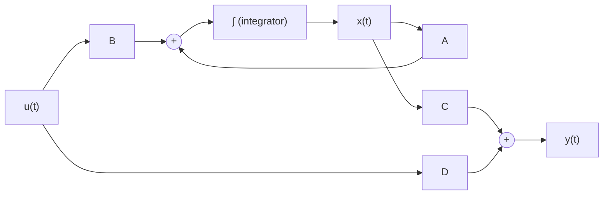

# 02 — Mathematical Modeling of Dynamic Systems

> *A system you cannot model is a system you cannot control. Mathematical modeling is the translation of physical reality into equations that reveal structure, behavior, and design opportunity.*

---

## 2.1 Why Mathematical Modeling?

Control design follows a universal pipeline:

```
  Physical System → Mathematical Model → Analysis → Controller Design → Implementation
```

Without a mathematical model, you cannot:
- Predict system behavior before building hardware
- Prove stability or performance guarantees
- Systematically design controllers (instead of guessing)
- Simulate and test before deployment

---

## 2.2 Differential Equations: The Language of Continuous Systems

Every continuous physical system obeys **ordinary differential equations (ODEs)** derived from conservation laws.

### Newton's Second Law (Mechanical)

$$F = ma \quad \Rightarrow \quad m\ddot{x} = \sum F_i$$

### Kirchhoff's Laws (Electrical)

$$\sum V_{loop} = 0 \quad \text{(KVL)}, \qquad \sum I_{node} = 0 \quad \text{(KCL)}$$

### Energy Balance (Thermal)

$$C_{th} \frac{dT}{dt} = \dot{Q}_{in} - \dot{Q}_{out}$$

### General Form

An $n$-th order linear, time-invariant (LTI) ODE:

$$a_n \frac{d^n y}{dt^n} + a_{n-1} \frac{d^{n-1} y}{dt^{n-1}} + \cdots + a_1 \frac{dy}{dt} + a_0 y = b_m \frac{d^m u}{dt^m} + \cdots + b_0 u$$

Where $y$ is the output, $u$ is the input, and the $a_i$, $b_j$ are constant coefficients determined by physical parameters.

---

## 2.3 The Laplace Transform

The Laplace transform converts differential equations into **algebraic equations**, making analysis vastly simpler.

### Definition

$$\mathcal{L}\{f(t)\} = F(s) = \int_0^{\infty} f(t) e^{-st} dt, \quad s = \sigma + j\omega$$

### Key Properties

| Time Domain | Laplace Domain | Property |
|---|---|---|
| $f(t)$ | $F(s)$ | Transform |
| $\dot{f}(t)$ | $sF(s) - f(0)$ | Differentiation |
| $\ddot{f}(t)$ | $s^2F(s) - sf(0) - \dot{f}(0)$ | 2nd derivative |
| $\int_0^t f(\tau)d\tau$ | $\frac{F(s)}{s}$ | Integration |
| $f(t-\tau)$ | $e^{-\tau s}F(s)$ | Time delay |
| $e^{-at}f(t)$ | $F(s+a)$ | Frequency shift |
| $f_1 * f_2$ | $F_1(s) \cdot F_2(s)$ | Convolution → Multiplication |

### Common Transform Pairs

| $f(t)$ | $F(s)$ |
|---|---|
| $\delta(t)$ | $1$ |
| $u(t)$ (unit step) | $\frac{1}{s}$ |
| $t$ | $\frac{1}{s^2}$ |
| $e^{-at}$ | $\frac{1}{s+a}$ |
| $\sin(\omega t)$ | $\frac{\omega}{s^2+\omega^2}$ |
| $\cos(\omega t)$ | $\frac{s}{s^2+\omega^2}$ |
| $t e^{-at}$ | $\frac{1}{(s+a)^2}$ |
| $1 - e^{-at}$ | $\frac{a}{s(s+a)}$ |

---

## 2.4 Transfer Functions

A **transfer function** relates output to input in the Laplace domain, assuming zero initial conditions.

$$G(s) = \frac{Y(s)}{U(s)} = \frac{b_m s^m + b_{m-1} s^{m-1} + \cdots + b_0}{a_n s^n + a_{n-1} s^{n-1} + \cdots + a_0}$$

### Poles and Zeros

- **Zeros**: Roots of the numerator → where $G(s) = 0$
- **Poles**: Roots of the denominator → where $G(s) \to \infty$

**Poles determine stability and transient behavior:**

| Pole Location | Behavior |
|---|---|
| Real, negative ($s = -a$) | Exponential decay $e^{-at}$ (stable) |
| Real, positive ($s = +a$) | Exponential growth $e^{at}$ (unstable) |
| Complex, negative real part ($s = -\sigma \pm j\omega$) | Damped oscillation (stable) |
| Complex, positive real part | Growing oscillation (unstable) |
| Imaginary ($s = \pm j\omega$) | Sustained oscillation (marginally stable) |

```
  Imaginary (jω)
       │
       │  ×  ← unstable oscillatory
       │    
  ─────┼───────── Real (σ)
  ×    │    ×
stable │  unstable
       │
       │  ×  ← unstable oscillatory
```

💡 **Insight**: The transfer function encodes everything about a system's input-output behavior. Two physically different systems with the same transfer function behave identically from an input-output perspective.

---

## 2.5 State-Space Models

The state-space representation is more general than transfer functions — it handles MIMO (multi-input multi-output) systems and directly reveals internal dynamics.

### Standard Form

$$\dot{\mathbf{x}}(t) = \mathbf{A}\mathbf{x}(t) + \mathbf{B}\mathbf{u}(t) \quad \text{(state equation)}$$
$$\mathbf{y}(t) = \mathbf{C}\mathbf{x}(t) + \mathbf{D}\mathbf{u}(t) \quad \text{(output equation)}$$

Where:
- $\mathbf{x} \in \mathbb{R}^n$: **State vector** (minimum set of variables that completely describes the system)
- $\mathbf{u} \in \mathbb{R}^m$: **Input vector**
- $\mathbf{y} \in \mathbb{R}^p$: **Output vector**
- $\mathbf{A} \in \mathbb{R}^{n \times n}$: **System matrix** (determines stability and natural modes)
- $\mathbf{B} \in \mathbb{R}^{n \times m}$: **Input matrix** (how inputs affect states)
- $\mathbf{C} \in \mathbb{R}^{p \times n}$: **Output matrix** (what we measure)
- $\mathbf{D} \in \mathbb{R}^{p \times m}$: **Feedthrough matrix** (direct input-to-output, often zero)

### Signal Flow Diagram



### Relationship to Transfer Function

For a SISO system:

$$G(s) = \mathbf{C}(s\mathbf{I} - \mathbf{A})^{-1}\mathbf{B} + \mathbf{D}$$

The eigenvalues of $\mathbf{A}$ are the poles of $G(s)$.

---

## 2.6 Linearization

Most real systems are nonlinear. We linearize around an **equilibrium point** to apply linear control theory.

### Procedure

Given a nonlinear system:
$$\dot{x} = f(x, u)$$

1. Find equilibrium: $f(x_0, u_0) = 0$
2. Define perturbation variables: $\delta x = x - x_0$, $\delta u = u - u_0$
3. Taylor expand and keep only first-order terms:

$$\dot{\delta x} \approx \frac{\partial f}{\partial x}\bigg|_{x_0, u_0} \delta x + \frac{\partial f}{\partial u}\bigg|_{x_0, u_0} \delta u$$

So:
$$\mathbf{A} = \frac{\partial f}{\partial x}\bigg|_{x_0, u_0}, \qquad \mathbf{B} = \frac{\partial f}{\partial u}\bigg|_{x_0, u_0}$$

### Example: Simple Pendulum

Nonlinear equation:
$$\ddot{\theta} + \frac{g}{l}\sin\theta = \frac{\tau}{ml^2}$$

Equilibrium at $\theta_0 = 0$ (hanging down):

$$\sin\theta \approx \theta \quad \text{for small } \theta$$

Linearized:
$$\ddot{\theta} + \frac{g}{l}\theta = \frac{\tau}{ml^2}$$

⚠️ **Pitfall**: The linearized model is only valid near the operating point. For the pendulum, this means $|\theta| \ll 1$ radian. At $\theta = \pi/2$ (horizontal), the linear model is useless.

---

## 2.7 The Z-Transform (Discrete-Time Systems)

For sampled-data and digital control systems, the Z-transform plays the same role as the Laplace transform.

### Definition

$$\mathcal{Z}\{f[k]\} = F(z) = \sum_{k=0}^{\infty} f[k] z^{-k}$$

### Key Relationship to Laplace Domain

The mapping between continuous and discrete domains:

$$z = e^{sT}$$

Where $T$ is the sampling period.

### Stability Criterion

| Laplace (s-domain) | Z-domain | Stable if |
|---|---|---|
| Left half-plane: $\text{Re}(s) < 0$ | Inside unit circle: $|z| < 1$ | All poles inside unit circle |

```
  s-plane                    z-plane
  jω                         Im
   │                          │
   │ Stable│Unstable    ──────┼────── Re
   │  ←    │   →             ╱│╲
  ─┼───────┼──── σ       ╱   │  ╲   Unit
   │       │             │ Stable│   circle
   │       │             ╲   │  ╱
   │       │               ╲_│_╱
```

---

## 2.8 Modeling Examples by Physical Domain

### Mechanical Systems

```
  ┌─────┐     ┌─────┐     ┌─────┐
  │     │  k  │     │  b  │     │
  │ Wall├─/\/\─┤  m  ├─[≡]─┤     │──► F(t)
  │     │     │     │     │     │
  └─────┘     └──┬──┘     └─────┘
                  │
                  ▼ x(t)
```

See: [examples/mass-spring-damper.md](examples/mass-spring-damper.md)

### Electrical Systems (RLC)

See: [examples/rlc-circuit-model.py](examples/rlc-circuit-model.py)

### Electromechanical Systems (DC Motor)

See: [examples/dc-motor-model.py](examples/dc-motor-model.py)

### Thermal Systems

See: [examples/thermal-system-model.md](examples/thermal-system-model.md)

---

## 2.9 Choosing the Right Model Representation

| Representation | Best For | Limitations |
|---|---|---|
| Transfer function | SISO analysis, classical control | Cannot represent MIMO, hides internal dynamics |
| State-space | MIMO, modern control, simulation | More abstract, harder to visualize |
| Block diagram | System architecture, interconnections | Qualitative without math |
| Difference equations | Digital implementation | Requires discretization step |
| Bond graphs | Multi-domain systems | Steep learning curve |

🔧 **Practical**: In industry, you'll often have a transfer function for analysis and a state-space model for simulation. Learn to convert between them fluently.

---

## Examples

| File | Description |
|---|---|
| [mass-spring-damper.md](examples/mass-spring-damper.md) | Complete derivation of the mass-spring-damper model |
| [dc-motor-model.py](examples/dc-motor-model.py) | DC motor modeling and simulation in Python |
| [thermal-system-model.md](examples/thermal-system-model.md) | Thermal system with resistance and capacitance |
| [rlc-circuit-model.py](examples/rlc-circuit-model.py) | RLC circuit analysis and step response |

---

**Previous section → [01-foundations/README.md](../01-foundations/README.md)**  
**Next section → [03-signals-and-systems/README.md](../03-signals-and-systems/README.md)**
