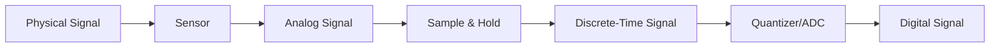
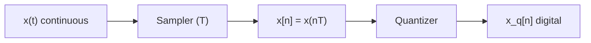
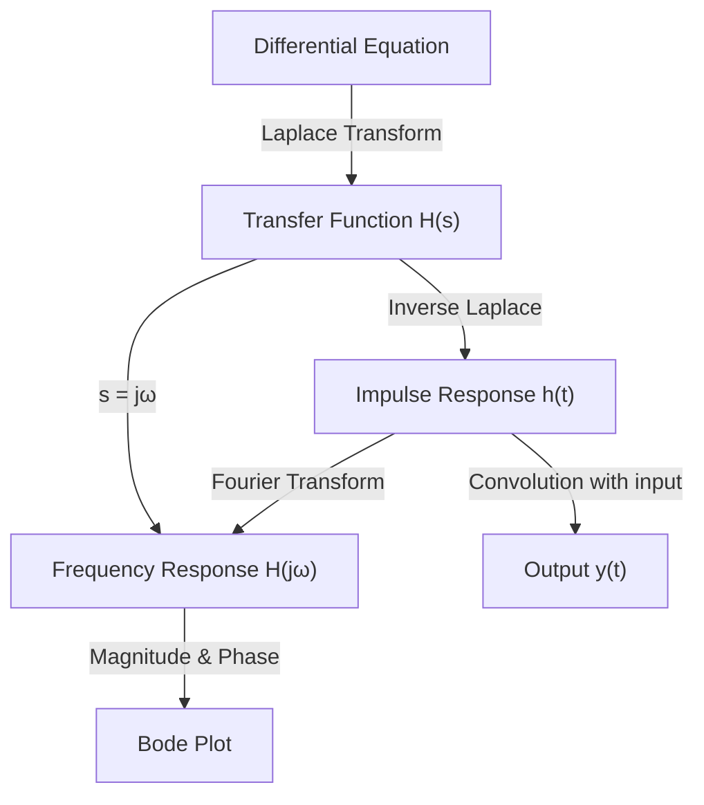

# 03 — Signals and Systems

> *Every control system processes signals. Understanding the nature of signals — continuous and discrete, in time and frequency domains — is essential for analysis, design, and implementation.*

---

## 3.1 What Is a Signal?

A **signal** is a function that conveys information about the state or behavior of a physical phenomenon.

| Type | Definition | Example |
|---|---|---|
| Continuous-time | $x(t)$, defined for all $t \in \mathbb{R}$ | Voltage from a microphone |
| Discrete-time | $x[n]$, defined at integer indices $n$ | Sampled temperature readings |
| Analog | Continuous in both time and amplitude | Real-world sensor output |
| Digital | Discrete in both time and amplitude | ADC output, computer data |



---

## 3.2 Common Signal Types

### Elementary Signals

| Signal | Continuous $x(t)$ | Discrete $x[n]$ | Use in Control |
|---|---|---|---|
| Unit step | $u(t) = \begin{cases}1, & t \geq 0 \\ 0, & t < 0\end{cases}$ | $u[n]$ | Test for steady-state behavior |
| Unit impulse | $\delta(t)$: $\int\delta(t)dt = 1$ | $\delta[n]$ | Characterizes system via impulse response |
| Ramp | $r(t) = t \cdot u(t)$ | $r[n] = n \cdot u[n]$ | Tests tracking of changing reference |
| Sinusoid | $A\sin(\omega t + \phi)$ | $A\sin(\Omega n + \phi)$ | Frequency response analysis |
| Exponential | $e^{st}$ (complex) | $z^n$ (complex) | Natural modes of LTI systems |

### Why These Signals Matter

The impulse response $h(t)$ **completely characterizes** an LTI system:

$$y(t) = h(t) * u(t) = \int_{-\infty}^{\infty} h(\tau) \cdot u(t - \tau) \, d\tau$$

If you know $h(t)$, you can compute the output for **any** input via convolution.

---

## 3.3 System Properties

A system $\mathcal{T}$ maps input signals to output signals: $y = \mathcal{T}\{x\}$.

| Property | Definition | Why It Matters |
|---|---|---|
| **Linearity** | $\mathcal{T}\{ax_1 + bx_2\} = a\mathcal{T}\{x_1\} + b\mathcal{T}\{x_2\}$ | Enables superposition and frequency-domain analysis |
| **Time-invariance** | $\mathcal{T}\{x(t-\tau)\} = y(t-\tau)$ | System behavior doesn't change over time |
| **Causality** | $y(t)$ depends only on $x(\tau)$ for $\tau \leq t$ | Physical realizability — can't use future inputs |
| **Stability** (BIBO) | Bounded input → Bounded output | System won't blow up |
| **Memory** | Output depends on past/future inputs | Memoryless: $y(t) = f(x(t))$ only |

### BIBO Stability Condition

For an LTI system with impulse response $h(t)$:

$$\text{BIBO Stable} \iff \int_{-\infty}^{\infty} |h(t)| \, dt < \infty$$

Equivalently, all poles of $H(s)$ must have negative real parts (lie in the left half-plane).

---

## 3.4 Convolution

Convolution is the fundamental operation of LTI systems.

### Continuous-Time Convolution

$$y(t) = x(t) * h(t) = \int_{-\infty}^{\infty} x(\tau) \cdot h(t - \tau) \, d\tau$$

### Discrete-Time Convolution

$$y[n] = x[n] * h[n] = \sum_{k=-\infty}^{\infty} x[k] \cdot h[n - k]$$

### Convolution in Frequency Domain

$$Y(s) = X(s) \cdot H(s) \quad \text{(Laplace)}$$
$$Y(j\omega) = X(j\omega) \cdot H(j\omega) \quad \text{(Fourier)}$$

**Convolution in time = Multiplication in frequency.** This is why frequency-domain analysis is so powerful.

See: [examples/convolution-example.py](examples/convolution-example.py)

---

## 3.5 Frequency Response and Fourier Analysis

### The Key Idea

If you input a sinusoid into an LTI system, the output is a sinusoid at the **same frequency** but with different **amplitude** and **phase**:

$$x(t) = A\sin(\omega t) \quad \xrightarrow{\text{LTI}} \quad y(t) = A|H(j\omega)|\sin(\omega t + \angle H(j\omega))$$

This is the **eigensignal property** of LTI systems.

### Fourier Transform

$$X(j\omega) = \int_{-\infty}^{\infty} x(t) e^{-j\omega t} dt$$

$$x(t) = \frac{1}{2\pi} \int_{-\infty}^{\infty} X(j\omega) e^{j\omega t} d\omega$$

### Fourier Transform Properties

| Property | Time Domain | Frequency Domain |
|---|---|---|
| Linearity | $ax(t) + by(t)$ | $aX(\omega) + bY(\omega)$ |
| Time shift | $x(t - t_0)$ | $X(\omega)e^{-j\omega t_0}$ |
| Frequency shift | $x(t)e^{j\omega_0 t}$ | $X(\omega - \omega_0)$ |
| Convolution | $x(t) * h(t)$ | $X(\omega) \cdot H(\omega)$ |
| Multiplication | $x(t) \cdot h(t)$ | $\frac{1}{2\pi}X(\omega) * H(\omega)$ |
| Differentiation | $\frac{dx}{dt}$ | $j\omega X(\omega)$ |
| Parseval's | $\int|x(t)|^2 dt$ | $\frac{1}{2\pi}\int|X(\omega)|^2 d\omega$ |

See: [examples/fourier-analysis.py](examples/fourier-analysis.py)

---

## 3.6 Sampling Theory

### The Sampling Process

Converting continuous signals to discrete requires **sampling** at rate $f_s = 1/T$ Hz.



### Nyquist-Shannon Sampling Theorem

> To perfectly reconstruct a band-limited signal with maximum frequency $f_{max}$, you must sample at:
> $$f_s > 2 f_{max}$$

The frequency $f_N = f_s / 2$ is the **Nyquist frequency**.

### What Happens When You Violate Nyquist: Aliasing

```
  Frequency spectrum of sampled signal:
  
  |X(f)|
    │    ╱╲         ╱╲         ╱╲         ╱╲
    │   ╱  ╲       ╱  ╲       ╱  ╲       ╱  ╲
    │  ╱    ╲     ╱    ╲     ╱    ╲     ╱    ╲
    │ ╱      ╲   ╱ OVERLAP╲ ╱      ╲   ╱      ╲
    │╱        ╲_╱  ↑ALIAS ╲╱        ╲_╱        ╲
    └──────────┬──────────┬──────────┬──────────── f
             -fs/2       0        fs/2          fs
```

When spectra overlap (aliasing), high-frequency content masquerades as low-frequency content, and **this distortion cannot be undone after sampling**.

⚠️ **Pitfall**: Aliasing is not just a theoretical concern. In control systems, aliased sensor noise can create phantom low-frequency disturbances that the controller tries to reject, making things worse.

🔧 **Practical**: Always use an **anti-aliasing filter** (analog low-pass filter) before the ADC. This filter must be analog — you can't digitally filter aliased signals because the damage is already done.

See: [examples/sampling-aliasing.md](examples/sampling-aliasing.md)

---

## 3.7 Impulse Response and System Characterization

### Relationship Between Representations



All four representations — differential equation, transfer function, impulse response, and frequency response — contain **exactly the same information** about an LTI system. They are different views of the same object.

See: [examples/impulse-response.md](examples/impulse-response.md)

---

## 3.8 Discrete Fourier Transform (DFT) and FFT

The **Discrete Fourier Transform** is the computational tool for frequency analysis of sampled data.

$$X[k] = \sum_{n=0}^{N-1} x[n] e^{-j2\pi kn/N}, \quad k = 0, 1, \ldots, N-1$$

The **Fast Fourier Transform (FFT)** computes the DFT in $O(N \log N)$ instead of $O(N^2)$.

### Practical FFT Considerations

| Parameter | Effect |
|---|---|
| Number of samples $N$ | Determines frequency resolution: $\Delta f = f_s / N$ |
| Sampling rate $f_s$ | Determines maximum frequency: $f_{max} = f_s / 2$ |
| Windowing | Reduces spectral leakage (Hanning, Hamming, Blackman) |
| Zero-padding | Interpolates in frequency (doesn't add resolution) |

---

## Examples

| File | Description |
|---|---|
| [convolution-example.py](examples/convolution-example.py) | Visual step-by-step convolution |
| [sampling-aliasing.md](examples/sampling-aliasing.md) | Demonstration of Nyquist theorem and aliasing |
| [fourier-analysis.py](examples/fourier-analysis.py) | FFT analysis of signals with Python |
| [impulse-response.md](examples/impulse-response.md) | System characterization via impulse response |

---

**Previous → [02-mathematical-modeling](../02-mathematical-modeling/README.md)**  
**Next → [04-analog-electronics](../04-analog-electronics/README.md)**
