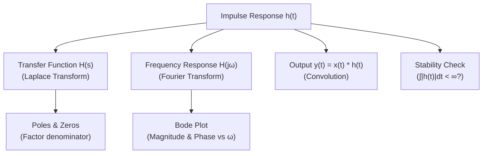

# Example: Impulse Response and System Characterization

## Purpose

Show how the impulse response completely characterizes an LTI system, and how it connects the time domain, frequency domain, and transfer function representations.

---

## Concept: The Impulse Response Is Everything

For a Linear Time-Invariant (LTI) system, if you know the impulse response $h(t)$, you can:

1. **Compute the output for any input**: $y(t) = x(t) * h(t)$
2. **Find the transfer function**: $H(s) = \mathcal{L}\{h(t)\}$
3. **Find the frequency response**: $H(j\omega) = \mathcal{F}\{h(t)\}$
4. **Determine stability**: BIBO stable iff $\int_0^\infty |h(t)| dt < \infty$



---

## Example: First-Order System

### Transfer Function

$$H(s) = \frac{1}{\tau s + 1}$$

### Impulse Response

$$h(t) = \frac{1}{\tau} e^{-t/\tau} u(t)$$

### Step Response (integral of impulse response)

$$y_{step}(t) = \int_0^t h(\tau) d\tau = \left(1 - e^{-t/\tau}\right) u(t)$$

### Frequency Response

$$H(j\omega) = \frac{1}{1 + j\omega\tau}$$

$$|H(j\omega)| = \frac{1}{\sqrt{1 + (\omega\tau)^2}}, \qquad \angle H(j\omega) = -\arctan(\omega\tau)$$

---

## Example: Second-Order System (Underdamped)

### Transfer Function

$$H(s) = \frac{\omega_n^2}{s^2 + 2\zeta\omega_n s + \omega_n^2}$$

### Impulse Response ($0 < \zeta < 1$)

$$h(t) = \frac{\omega_n}{\sqrt{1-\zeta^2}} e^{-\zeta\omega_n t} \sin(\omega_d t) \cdot u(t)$$

where $\omega_d = \omega_n\sqrt{1-\zeta^2}$ is the damped natural frequency.

### Visualization for Different Damping

```
  h(t) for ζ = 0.1 (lightly damped):
  
       │    ╱╲
       │   ╱  ╲      ╱╲
       │  ╱    ╲    ╱  ╲      ╱╲
  0 ───┤─╱──────╲──╱────╲────╱──╲──────── t
       │          ╲╱      ╲  ╱    ╲
       │                   ╲╱      slow decay
  
  h(t) for ζ = 0.5 (moderately damped):
  
       │   ╱╲
       │  ╱  ╲
       │ ╱    ╲  ╱╲
  0 ───┤╱──────╲╱──╲──────────────── t
       │             fast decay
  
  h(t) for ζ = 0.9 (heavily damped):
  
       │  ╱╲
       │ ╱  ╲
  0 ───┤╱────╲──────────────────── t
       │       very fast decay, barely oscillates
```

---

## Practical: How to Measure Impulse Response

In practice, a perfect impulse $\delta(t)$ is impossible to generate. Common alternatives:

### Method 1: Step Response Differentiation

Apply a step input and differentiate the output numerically:

$$h(t) = \frac{d}{dt} y_{step}(t)$$

### Method 2: Pseudo-Random Binary Sequence (PRBS)

Apply a PRBS signal and cross-correlate with the output:

$$\hat{h}(\tau) = R_{xy}(\tau) = \int x(t) y(t + \tau) dt$$

This works because the autocorrelation of a PRBS approximates an impulse.

### Method 3: Frequency Sweep (Chirp)

Apply a frequency sweep and measure the magnitude and phase at each frequency to build $H(j\omega)$ directly. Then inverse-FFT to get $h(t)$.

🔧 **Practical**: Method 1 (step response) is the most common in control engineering. Method 3 (frequency sweep) is standard in audio and vibration testing. Method 2 (PRBS) is used in system identification for industrial processes.

---

## Connection to Stability

### Stable System
$h(t) \to 0$ as $t \to \infty$ (decaying impulse response)
- All poles have negative real parts
- $\int_0^\infty |h(t)| dt < \infty$

### Marginally Stable System
$h(t)$ is bounded but does not decay (sustained oscillation or constant)
- Poles on the imaginary axis (non-repeated)
- $\int_0^\infty |h(t)| dt = \infty$

### Unstable System
$h(t) \to \infty$ as $t \to \infty$ (growing impulse response)
- At least one pole with positive real part
- BIBO unstable

---

## Key Insights

1. The impulse response is the system's "fingerprint" — it uniquely identifies an LTI system
2. Convolution with $h(t)$ is the time-domain computation; multiplication with $H(j\omega)$ is the frequency-domain computation. Same result, different perspectives.
3. A fast-decaying $h(t)$ means a wide-bandwidth system (responds quickly)
4. An oscillatory $h(t)$ means a resonant system (has a peak in frequency response)
5. The area under $h(t)$ equals $H(0)$ = the DC gain of the system
