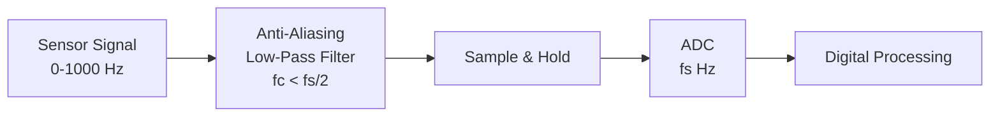

# Example: Sampling and Aliasing Demonstration

## Purpose

Demonstrate the Nyquist-Shannon sampling theorem and show what happens when it is violated (aliasing). This is critical for any digital control system implementation.

---

## Setup

Consider a signal composed of two sinusoids:

$$x(t) = \sin(2\pi \cdot 5 \cdot t) + 0.5\sin(2\pi \cdot 50 \cdot t)$$

- Component 1: 5 Hz (the signal of interest)
- Component 2: 50 Hz (high-frequency content — could be noise or a real signal)

---

## Case 1: Adequate Sampling ($f_s = 200$ Hz)

Nyquist frequency: $f_N = 100$ Hz > 50 Hz ✓

Both components are below the Nyquist frequency, so both are captured correctly.

```
  Frequency spectrum (continuous):
  
  |X(f)|
  1.0 │  ╲
      │   ╲  5 Hz
  0.5 │    ╲          ╲  50 Hz
      │                ╲
  0   ┼────┬───────────┬────────────── f [Hz]
      0    5          50    100 (f_N)
                            ↑
                     Nyquist frequency
                     
  Result: Both frequencies correctly captured ✓
```

---

## Case 2: Marginal Sampling ($f_s = 80$ Hz)

Nyquist frequency: $f_N = 40$ Hz < 50 Hz ✗

The 50 Hz component violates the Nyquist criterion!

### What Happens: Aliasing

The 50 Hz signal is "reflected" about the Nyquist frequency:

$$f_{alias} = f_s - f_{signal} = 80 - 50 = 30 \text{ Hz}$$

```
  Frequency spectrum (sampled):
  
  |X(f)|
  1.0 │  ╲
      │   ╲  5 Hz
  0.5 │    ╲     ╲  30 Hz (ALIAS of 50 Hz!)
      │           ╲
  0   ┼────┬──────┬─────── f [Hz]
      0    5     30  40 (f_N)
  
  The 50 Hz component appears as a phantom 30 Hz signal!
  This CANNOT be removed by digital filtering.
```

### Physical Analogy: The Wagon Wheel Effect

In old Western movies, wagon wheels sometimes appear to rotate backward. This is aliasing:
- The camera samples at a fixed frame rate (e.g., 24 fps)
- If the spoke passes more than 12 positions per second, aliasing occurs
- The spoke appears to move in the wrong direction

---

## Case 3: Severe Under-Sampling ($f_s = 12$ Hz)

Nyquist frequency: $f_N = 6$ Hz

$$f_{alias,1} = |12 - 50| = 38 \to |12 - 38| = 26 \to |12 - 26| = 14 \to |12 - 14| = 2 \text{ Hz}$$

(The aliased frequency folds repeatedly until it lands within $[0, f_N]$.)

More precisely: $50 \mod 12 = 2$ Hz, but we need to check the folding:
- $50 / 12 = 4.167$, so $50 - 4 \times 12 = 2$ Hz
- Since this is less than $f_N = 6$ Hz, the alias is at **2 Hz**

```
  Both the 5 Hz signal (barely captured) and the phantom 2 Hz alias
  are now in the same frequency range — completely indistinguishable!
```

⚠️ **Pitfall**: In a control system, this means a 50 Hz vibration (perhaps from a motor) would appear as a 2 Hz oscillation in the sampled data. The controller would try to reject this phantom disturbance, potentially making the real system worse.

---

## Anti-Aliasing Filter

### Solution: Low-Pass Filter Before Sampling



**Design rules:**
1. Choose sampling rate: $f_s \geq 2 \times f_{max,interest}$ (often 5-10× for safety)
2. Design analog low-pass filter with cutoff $f_c < f_s / 2$
3. Filter must attenuate frequencies above $f_s / 2$ sufficiently (typically 40-80 dB)

### Filter Order Requirements

| Attenuation needed at $f_s/2$ | Minimum filter order (Butterworth) |
|---|---|
| 20 dB | 1st order (may be sufficient for clean signals) |
| 40 dB | 2nd order |
| 60 dB | 3rd order |
| 80 dB | 4th order (common in data acquisition) |

🔧 **Practical**: In control applications, a 2nd-order Butterworth anti-aliasing filter is usually sufficient. In precision measurement (audio, vibration analysis), 4th-order or higher is common.

---

## Quantitative Design Example

### Scenario: Temperature Control System

- Signal bandwidth of interest: 0-1 Hz (temperatures change slowly)
- Known noise sources: 50/60 Hz mains, fan vibration at 30 Hz
- Desired: sample temperature for digital PID controller

### Design:

1. **Sampling rate**: $f_s = 20$ Hz (10× the bandwidth of interest — generous)
2. **Nyquist frequency**: $f_N = 10$ Hz
3. **Anti-aliasing filter**: 2nd-order Butterworth, $f_c = 5$ Hz
   - At 10 Hz: attenuation = $-12$ dB
   - At 30 Hz: attenuation = $-31$ dB
   - At 50 Hz: attenuation = $-40$ dB ✓
4. **Result**: Mains noise attenuated 100× before sampling

### Transfer Function of Anti-Aliasing Filter

2nd-order Butterworth with $\omega_c = 2\pi \cdot 5 = 31.4$ rad/s:

$$H(s) = \frac{\omega_c^2}{s^2 + \sqrt{2}\omega_c s + \omega_c^2}$$

---

## Common Mistakes in Practice

| Mistake | Consequence | Fix |
|---|---|---|
| No anti-aliasing filter | High-freq noise aliases into control band | Always use analog filter before ADC |
| Filter cutoff > $f_s/2$ | Insufficient alias rejection | Set $f_c \leq 0.4 \cdot f_s$ |
| Using digital filter for anti-aliasing | Aliasing occurs before the digital filter | Anti-aliasing must be analog |
| Sampling too fast | Wastes memory, CPU; may amplify noise | Match $f_s$ to actual bandwidth needs |
| Sampling too slow | Misses dynamics, aliases disturbances | Use 5-10× bandwidth as minimum |

---

## Expected Understanding After This Example

1. Aliasing is a physical phenomenon that cannot be corrected after sampling
2. The Nyquist theorem is a hard limit, not a suggestion
3. Anti-aliasing filters must be analog (before the ADC)
4. In control systems, aliasing can create phantom disturbances
5. Practical sampling rates are 5-20× the signal bandwidth, not just 2×
