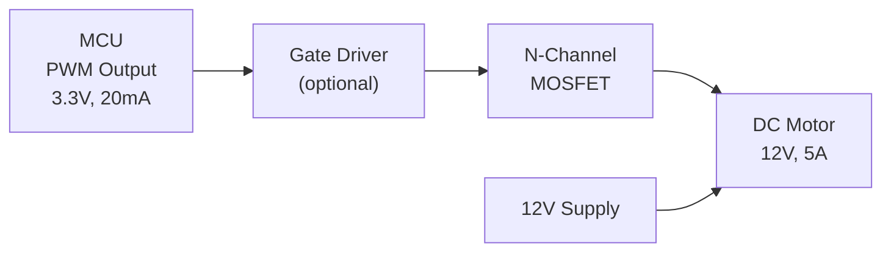

# Example: MOSFET as a Switch for Motor Control

## Purpose

Design a MOSFET switching circuit to drive a DC motor from a microcontroller's PWM output. This is the interface between digital control logic and high-power actuators — one of the most common circuits in embedded control systems.

---

## Why MOSFET Switching?

A microcontroller GPIO pin can output ~20 mA at 3.3V or 5V. A typical DC motor draws 0.5–10A at 12–48V. The MOSFET bridges this gap:



---

## Basic Circuit: Low-Side N-Channel MOSFET Switch

```
        V_motor (12V)
            │
         ┌──┴──┐
         │MOTOR│
         │  M  │
         └──┬──┘
            │
       ┌────┤ Drain (D)
       │    │
  Flyback   │──┤ MOSFET (N-ch)
  Diode     │  │ e.g., IRLZ44N
       │    │──┤
       └────┤ Source (S)
            │
           GND
            
  Gate drive:
  MCU_PWM ── R_gate(100Ω) ──┬── Gate
                             │
                        R_pulldown(10kΩ)
                             │
                            GND
```

---

## Component Selection

### MOSFET Requirements

| Parameter | Requirement | Selected: IRLZ44N |
|---|---|---|
| $V_{DS,max}$ | > Motor voltage × 1.5 | 55 V ✓ |
| $I_{D,max}$ | > Motor stall current | 47 A ✓ |
| $R_{DS,on}$ | As low as possible | 22 mΩ @ $V_{GS}$ = 5V |
| $V_{GS,th}$ | < MCU output voltage | 1.0–2.0 V ✓ (logic-level!) |
| $V_{GS,max}$ | Must withstand gate drive | ±16 V ✓ |

💡 **Insight**: Use a **logic-level MOSFET** (low $V_{GS,th}$) when driving directly from a 3.3V or 5V MCU. Standard MOSFETs require 10V gate drive and won't fully turn on from logic levels.

### Flyback Diode (Critical!)

When the MOSFET turns off, the motor's inductance tries to maintain current. Without a flyback diode, the voltage across the MOSFET spikes to destructive levels.

$$V_{spike} = L_{motor} \frac{dI}{dt} \quad \text{(can be hundreds of volts!)}$$

**Diode selection:**
- Must handle motor current: $I_F > I_{motor}$
- Fast recovery (Schottky preferred): low reverse recovery time
- Voltage rating: > $V_{motor}$
- Example: 1N5822 (Schottky, 3A, 40V) or SS54 (5A, 40V)

### Gate Resistor $R_{gate}$

Limits the gate charging current to protect the MCU pin:

$$I_{gate,peak} = \frac{V_{MCU}}{R_{gate}} = \frac{3.3}{100} = 33 \text{ mA}$$

Also controls switching speed (rise/fall time):

$$t_{rise} \approx R_{gate} \times (C_{iss}) \times 2.2$$

For IRLZ44N: $C_{iss} \approx 1700$ pF, $t_{rise} \approx 100 \times 1700 \times 10^{-12} \times 2.2 \approx 374$ ns

### Pull-Down Resistor $R_{pulldown}$

Ensures the MOSFET stays OFF when:
- MCU pin is in high-impedance state (reset, boot-up)
- MCU GPIO is not yet configured

Without this, the gate floats and the MOSFET may turn on uncontrollably.

⚠️ **Pitfall**: Forgetting the pull-down resistor is one of the most common motor control bugs. The motor runs unexpectedly during MCU boot, potentially causing damage or injury.

---

## Power Dissipation Analysis

### Conduction Loss

$$P_{cond} = I_D^2 \times R_{DS,on} = 5^2 \times 0.022 = 0.55 \text{ W}$$

### Switching Loss (at PWM frequency $f_{PWM}$)

$$P_{sw} = \frac{1}{2} V_{DS} \cdot I_D \cdot (t_{rise} + t_{fall}) \cdot f_{PWM}$$

At 20 kHz PWM:
$$P_{sw} = \frac{1}{2} \times 12 \times 5 \times (374 + 374) \times 10^{-9} \times 20000 \approx 0.45 \text{ W}$$

### Total and Thermal

$$P_{total} = P_{cond} + P_{sw} = 0.55 + 0.45 = 1.0 \text{ W}$$

Temperature rise (TO-220 package, no heatsink):
$$\Delta T = P \times R_{th,JA} = 1.0 \times 62 = 62°C$$

At 25°C ambient: $T_J = 87°C$ (within 175°C limit, but add a small heatsink for margin).

---

## H-Bridge for Bidirectional Control

For bidirectional motor control, use an H-Bridge:

```
    V_motor ────┬──────────┬────
                │          │
              Q1(P)      Q3(P)
                │          │
                ├── Motor ─┤
                │          │
              Q2(N)      Q4(N)
                │          │
    GND ────────┴──────────┴────
    
    Forward:  Q1 ON, Q4 ON, Q2 OFF, Q3 OFF
    Reverse:  Q3 ON, Q2 ON, Q1 OFF, Q4 OFF
    Brake:    Q2 ON, Q4 ON (low-side short)
```

⚠️ **Critical**: Never turn on Q1+Q2 or Q3+Q4 simultaneously — this creates a **shoot-through** short circuit that destroys the MOSFETs instantly. Always include dead-time between switching.

🔧 **Practical**: For production designs, use a dedicated H-bridge driver IC (e.g., L298N, DRV8871, TB6612FNG) that handles dead-time, current sensing, and protection internally.

---

## Expected Results

| Parameter | Value |
|---|---|
| MOSFET on-resistance loss | 0.55 W at 5A |
| Switching loss at 20 kHz | 0.45 W |
| Total MOSFET dissipation | 1.0 W |
| Gate drive current | 33 mA peak |
| Turn-on time | ~374 ns |
| Safe operating temperature | < 100°C with small heatsink |
