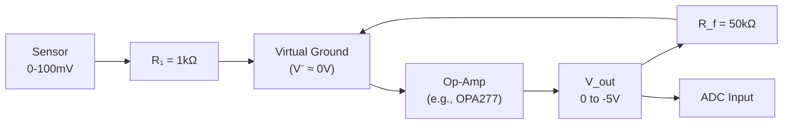

# Example: Op-Amp Inverting Amplifier — Complete Design

## Purpose

Design an inverting amplifier using an operational amplifier. Derive the gain, analyze bandwidth limitations, and discuss practical design considerations.

---

## Circuit

```
                    R_f (feedback)
               ┌────/\/\/────┐
               │             │
  V_in ──R₁──┬┘        ┌────┴───── V_out
              │         │
              ├── (−) input
              │    Op-Amp
              ├── (+) input
              │
             GND
```

---

## Ideal Analysis

Using the virtual short ($V_- = V_+ = 0$) and zero input current assumptions:

**At the inverting node:**

$$\frac{V_{in} - 0}{R_1} + \frac{V_{out} - 0}{R_f} = 0$$

$$\frac{V_{in}}{R_1} = -\frac{V_{out}}{R_f}$$

$$\boxed{\frac{V_{out}}{V_{in}} = -\frac{R_f}{R_1}}$$

**Key properties:**
- Gain magnitude: $|A_v| = R_f / R_1$
- Signal is **inverted** (180° phase shift)
- Input impedance: $Z_{in} = R_1$ (not infinite!)
- Output impedance: ≈ 0 (op-amp drives the output)

---

## Numerical Design Example

**Requirement**: Amplify a 0–100 mV sensor signal to 0–5 V range for an ADC.

**Required gain**: $|A_v| = 5.0 / 0.1 = 50$

**Design choices:**
- $R_1 = 1 \text{ k}\Omega$ (sets input impedance)
- $R_f = R_1 \times |A_v| = 1\text{k} \times 50 = 50 \text{ k}\Omega$

**Verification:**
$$V_{out} = -\frac{50\text{k}}{1\text{k}} \times V_{in} = -50 \times V_{in}$$

For $V_{in} = 100$ mV: $V_{out} = -5.0$ V ✓ (inverted)

⚠️ **Note**: The output is inverted. If you need a positive output from a positive input, use a non-inverting configuration or add an inverting stage.

---

## Practical Considerations

### 1. Gain-Bandwidth Product (GBW)

Real op-amps have finite bandwidth. The open-loop gain rolls off at 20 dB/decade:

$$A_{OL}(f) = \frac{A_0}{1 + j \cdot f / f_1}$$

The closed-loop bandwidth:

$$f_{-3dB} = \frac{GBW}{1 + R_f/R_1} = \frac{GBW}{51}$$

For a typical op-amp with GBW = 1 MHz: $f_{-3dB} = 1\text{M} / 51 \approx 19.6 \text{ kHz}$

### 2. Slew Rate Limitation

$$\text{Max output frequency} = \frac{SR}{2\pi V_{peak}}$$

For SR = 0.5 V/μs and $V_{peak}$ = 5 V:
$$f_{max} = \frac{0.5 \times 10^6}{2\pi \times 5} \approx 15.9 \text{ kHz}$$

### 3. Input Bias Current

Real op-amps draw small input currents ($I_B$). To minimize offset:

Add a compensation resistor at the non-inverting input:

$$R_{comp} = R_1 \| R_f = \frac{R_1 \cdot R_f}{R_1 + R_f} = \frac{1\text{k} \times 50\text{k}}{51\text{k}} \approx 980 \;\Omega$$

### 4. Power Supply Considerations

- Output cannot exceed supply rails: $V_{out,max} \approx V_{CC} - 1\text{V}$ (standard op-amps)
- Use rail-to-rail op-amps if output must swing close to supply
- For our example: need at least $V_{CC} > 5\text{V}$, so use ±12V or single +12V with mid-rail bias

---

## Block Diagram



---

## Component Selection Guide

| Parameter | Requirement | Suggested Part |
|---|---|---|
| Op-amp | Low noise, low offset, GBW > 1 MHz | OPA277, AD8605 |
| R₁ | 1 kΩ ± 1% | Metal film resistor |
| R_f | 50 kΩ ± 1% | Metal film resistor |
| R_comp | 980 Ω (use 1 kΩ) | Metal film resistor |
| Bypass caps | 100 nF ceramic near supply pins | MLCC X7R |

---

## Expected Results

| Parameter | Value |
|---|---|
| DC Gain | −50 (34 dB) |
| Input impedance | 1 kΩ |
| Bandwidth (−3 dB) | ~19.6 kHz (for 1 MHz GBW op-amp) |
| Output noise (estimated) | ~50 μV RMS (depends on op-amp choice) |
| Maximum output swing | $\pm(V_{CC} - 1)$ V |
