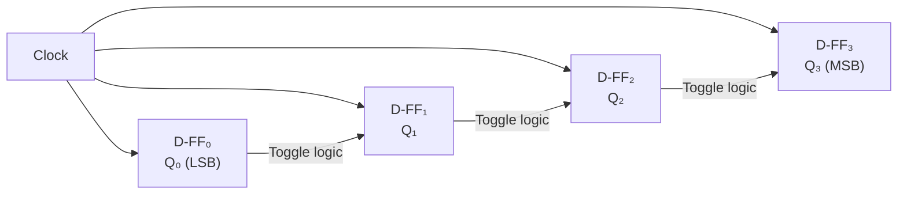
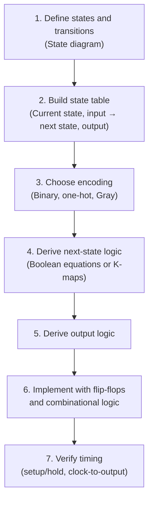

# 05 — Digital Electronics

> *Digital electronics processes information as discrete binary values. While control systems often deal with continuous physical quantities, the controllers themselves are increasingly digital — making this knowledge essential for any controls engineer.*

---

## 5.1 Logic Gates — The Building Blocks

All digital circuits are built from a small set of logic gates.

### Fundamental Gates

| Gate | Symbol | Boolean Expression | Truth Table |
|---|---|---|---|
| NOT (Inverter) | $\overline{A}$ | $Y = \overline{A}$ | 0→1, 1→0 |
| AND | $A \cdot B$ | $Y = A \cdot B$ | 1 only if both 1 |
| OR | $A + B$ | $Y = A + B$ | 1 if either 1 |
| NAND | $\overline{A \cdot B}$ | $Y = \overline{AB}$ | 0 only if both 1 |
| NOR | $\overline{A + B}$ | $Y = \overline{A+B}$ | 0 if either 1 |
| XOR | $A \oplus B$ | $Y = A\overline{B} + \overline{A}B$ | 1 if inputs differ |

### NAND and NOR as Universal Gates

Any logic function can be built from NAND gates alone (or NOR gates alone):

$$\text{NOT}(A) = A \text{ NAND } A$$
$$\text{AND}(A,B) = \text{NOT}(A \text{ NAND } B)$$
$$\text{OR}(A,B) = \text{NOT}(A) \text{ NAND } \text{NOT}(B)$$

💡 **Insight**: This is why NAND is called a "universal gate." In practice, CMOS technology naturally implements NAND and NOR, making them the preferred building blocks in IC design.

---

## 5.2 Boolean Algebra and Minimization

### Key Boolean Algebra Laws

| Law | AND Form | OR Form |
|---|---|---|
| Identity | $A \cdot 1 = A$ | $A + 0 = A$ |
| Null | $A \cdot 0 = 0$ | $A + 1 = 1$ |
| Idempotent | $A \cdot A = A$ | $A + A = A$ |
| Complement | $A \cdot \overline{A} = 0$ | $A + \overline{A} = 1$ |
| De Morgan's | $\overline{AB} = \overline{A} + \overline{B}$ | $\overline{A+B} = \overline{A} \cdot \overline{B}$ |

### Karnaugh Map Minimization

A Karnaugh map (K-map) provides a visual method for simplifying Boolean expressions by grouping adjacent 1s.

**Example**: Simplify $F(A,B,C) = \sum m(1,2,3,5,7)$

```
          BC
  AB   00  01  11  10
   0  │ 0 │ 1 │ 1 │ 1 │
   1  │ 0 │ 1 │ 1 │ 0 │
   
  Groups:
  - Column 01,11 (B=1): gives "B"
  - Row 0, columns 01,10 (Ā): gives "Ā·C + Ā·B" 
  
  Simplified: F = B + ĀC
```

---

## 5.3 Combinational Logic

Combinational circuits: output depends **only on current inputs** (no memory).

### Key Combinational Blocks

| Block | Function | Example Use |
|---|---|---|
| Multiplexer (MUX) | Select one of $2^n$ inputs | Data routing, lookup tables |
| Demultiplexer (DEMUX) | Route input to one of $2^n$ outputs | Address decoding |
| Decoder | $n$-to-$2^n$ line activation | Memory address decoding |
| Encoder | $2^n$-to-$n$ binary encoding | Priority interrupt handling |
| Adder | Binary addition | Arithmetic operations |
| Comparator | Compare two numbers | Threshold detection |

### Ripple Carry Adder

```
  Full Adder cell:
  
  A_i ──┬─►[XOR]──┬─►[XOR]──► S_i (Sum)
        │         │
  B_i ──┤         │
        │    ┌────┘
        ├─►[AND]──┬─►[OR]──► C_out (Carry)
        │         │
  C_in ─┤─►[AND]──┘
        │
        └─►[XOR]──┘ (connected above)
  
  4-bit adder: chain 4 full adders, C_out_i → C_in_(i+1)
```

See: [examples/combinational-logic.md](examples/combinational-logic.md)

---

## 5.4 Sequential Logic

Sequential circuits: output depends on current inputs **AND past history** (memory).

### Latches and Flip-Flops

| Type | Trigger | Characteristic | Use Case |
|---|---|---|---|
| SR Latch | Level | Set/Reset, invalid state | Basic memory |
| D Latch | Level | Transparent when enabled | Temporary storage |
| D Flip-Flop | Edge | Captures D at clock edge | Registers, pipelines |
| JK Flip-Flop | Edge | Toggle capability | Counters |
| T Flip-Flop | Edge | Toggles on T=1 | Frequency dividers |

### D Flip-Flop Behavior

```
        ┌─────┐
  D ───►│     │
        │  D  ├──► Q
  CLK ─►│ FF  │
        │     ├──► Q̄
        └─────┘
  
  Timing:
  CLK:  ──┐  ┌──┐  ┌──┐  ┌──
          └──┘  └──┘  └──┘
  D:    ─────┐     ┌──────────
             └─────┘
  Q:    ──────────┐     ┌─────
                  └─────┘
         ↑ Q captures D at rising edge of CLK
```

See: [examples/flip-flop-timing.md](examples/flip-flop-timing.md)

---

## 5.5 Counters and Registers

### Binary Counter (Synchronous)



### Shift Register

Shift registers move data one bit per clock cycle. Applications:
- Serial-to-parallel conversion (SPI data reception)
- Parallel-to-serial conversion (SPI data transmission)
- Delay lines
- Pseudo-random number generation (LFSR)

See: [examples/counter-verilog.v](examples/counter-verilog.v)

---

## 5.6 Finite State Machines (FSMs)

FSMs are the **most powerful concept in digital design** for control logic.

### Moore Machine vs. Mealy Machine

| Property | Moore | Mealy |
|---|---|---|
| Output depends on | State only | State AND input |
| Output changes | With state transitions | Immediately with input |
| Timing | Synchronous outputs | Can have asynchronous outputs |
| # States | Generally more | Generally fewer |
| Preferred for | Control logic, safety | Data path, protocol handlers |

### FSM Design Methodology



### State Encoding Comparison

| Encoding | States for 4 states | Flip-Flops | Logic Complexity | Speed |
|---|---|---|---|---|
| Binary | 00, 01, 10, 11 | 2 | Higher | Moderate |
| One-hot | 0001, 0010, 0100, 1000 | 4 | Lower | Fastest |
| Gray | 00, 01, 11, 10 | 2 | Moderate | Fewer glitches |

See: [examples/fsm-design.md](examples/fsm-design.md)

---

## 5.7 Timing Analysis

### Critical Timing Parameters

```
                    Setup    Hold
                    time     time
                    ←──►    ←──►
  D:    ────────────╱════════╲────────
                   ↕         ↕
  CLK:  ──────────┐          ┌────────
                  └──────────┘
                  ↑
              Clock edge
              
  D must be stable during the setup+hold window around the clock edge.
```

### Maximum Clock Frequency

$$T_{clk,min} = t_{clk \to Q} + t_{comb,max} + t_{setup}$$

$$f_{max} = \frac{1}{T_{clk,min}}$$

Where:
- $t_{clk \to Q}$: Clock-to-output delay of the source flip-flop
- $t_{comb,max}$: Worst-case combinational logic delay
- $t_{setup}$: Setup time of the destination flip-flop

### Metastability

When setup/hold times are violated (e.g., asynchronous inputs), the flip-flop can enter a **metastable** state — neither 0 nor 1 — for an unpredictable duration.

**Mitigation**: Use a **synchronizer chain** (two or more flip-flops in series) for any asynchronous input crossing into a clock domain.

⚠️ **Pitfall**: Metastability cannot be completely eliminated, only made statistically improbable. MTBF increases exponentially with each synchronizer stage.

---

## 5.8 HDL Concepts

### Verilog vs. VHDL

| Aspect | Verilog | VHDL |
|---|---|---|
| Origin | C-like syntax | Ada-like syntax |
| Typing | Weakly typed | Strongly typed |
| Industry use | Predominant in US/Asia | Predominant in Europe/defense |
| Learning curve | Easier for software engineers | Steeper but catches more errors |

### Synthesis vs. Simulation

- **Simulation**: Verify logic correctness (all HDL constructs available)
- **Synthesis**: Convert to hardware (only synthesizable subset allowed)

⚠️ **Pitfall**: `initial` blocks, `#delay` statements, and `$display` are for simulation only — they don't create hardware!

---

## Examples

| File | Description |
|---|---|
| [fsm-design.md](examples/fsm-design.md) | Sequence detector FSM design |
| [counter-verilog.v](examples/counter-verilog.v) | Parameterized up/down counter in Verilog |
| [combinational-logic.md](examples/combinational-logic.md) | 7-segment decoder design |
| [flip-flop-timing.md](examples/flip-flop-timing.md) | Timing analysis and metastability |

---

**Previous → [04-analog-electronics](../04-analog-electronics/README.md)**  
**Next → [06-power-electronics](../06-power-electronics/README.md)**
