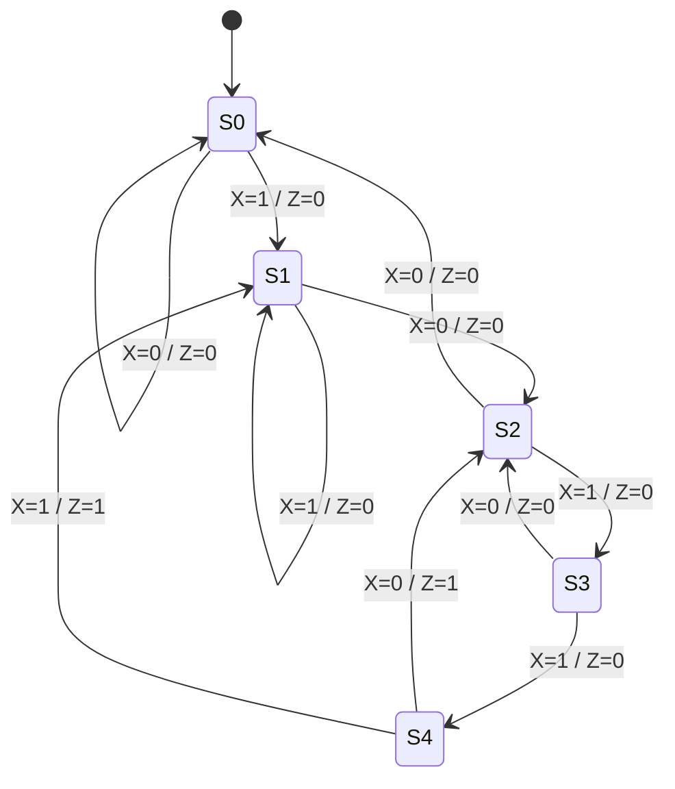

# Example: Finite State Machine Design — Sequence Detector

## Purpose

Design a Moore-type FSM that detects the bit sequence "1011" in a serial input stream. This demonstrates the complete FSM design methodology from specification to implementation.

---

## Specification

- **Input**: Single-bit serial input `X`, sampled on each clock rising edge
- **Output**: `Z = 1` when the last four bits received are "1011"
- **Type**: Moore machine (output depends only on current state)
- **Overlap**: Allow overlapping sequences (e.g., "10110**11**" should detect at both positions)

---

## Step 1: State Diagram



### State Meanings

| State | Meaning | Sequence Seen So Far |
|---|---|---|
| S0 | Initial / no progress | (none) |
| S1 | Received "1" | "1" |
| S2 | Received "10" | "10" |
| S3 | Received "101" | "101" |
| S4 | Received "1011" — **DETECTED!** | "1011" |

---

## Step 2: State Transition Table

| Current State | Input X | Next State | Output Z |
|---|---|---|---|
| S0 | 0 | S0 | 0 |
| S0 | 1 | S1 | 0 |
| S1 | 0 | S2 | 0 |
| S1 | 1 | S1 | 0 |
| S2 | 0 | S0 | 0 |
| S2 | 1 | S3 | 0 |
| S3 | 0 | S2 | 0 |
| S3 | 1 | S4 | 0 |
| S4 | 0 | S2 | 1 |
| S4 | 1 | S1 | 1 |

**Why S4→S2 on X=0?** After detecting "1011", if the next bit is 0, we have "...10110". The "10" at the end is the start of a potential new "1011" — so we go to S2, not S0.

**Why S4→S1 on X=1?** After "1011", if next is 1, we have "...10111". The trailing "1" could start a new sequence — go to S1.

---

## Step 3: State Encoding

Using binary encoding (3 flip-flops for 5 states):

| State | Q2 Q1 Q0 |
|---|---|
| S0 | 000 |
| S1 | 001 |
| S2 | 010 |
| S3 | 011 |
| S4 | 100 |

---

## Step 4: Next-State Logic

From the state table, derive Boolean equations for each next-state bit:

**$Q2^+ = Q1 \cdot Q0 \cdot X$** (only S3 + X=1 goes to S4)

**$Q1^+$** (next-state Q1):
| Current | X=0 | X=1 |
|---|---|---|
| S0(000) | 0 | 0 |
| S1(001) | 1 | 0 |
| S2(010) | 0 | 1 |
| S3(011) | 1 | 0 |
| S4(100) | 1 | 0 |

$Q1^+ = Q0 \cdot \overline{X} + Q1 \cdot \overline{Q0} \cdot X + Q2 \cdot \overline{X}$

**$Q0^+$** (next-state Q0):
| Current | X=0 | X=1 |
|---|---|---|
| S0(000) | 0 | 1 |
| S1(001) | 0 | 1 |
| S2(010) | 0 | 1 |
| S3(011) | 0 | 0 |
| S4(100) | 0 | 1 |

$Q0^+ = X \cdot \overline{Q1 \cdot Q0}$

---

## Step 5: Output Logic

$$Z = Q2$$ (only state S4 has Q2=1)

---

## Step 6: Verification Trace

Input sequence: `1 0 1 1 0 1 1 1 0 1 1`

```
Clock:   1   2   3   4   5   6   7   8   9  10  11
X:       1   0   1   1   0   1   1   0   1   1   ←
State:  S0→S1→S2→S3→S4→S2→S3→S4→S2→S3→S4
Z:       0   0   0   0   1   0   0   1   0   0   1
                         ↑               ↑           ↑
                      "1011"          "1011"       "1011"
                      detected!       detected!    detected!
```

Three overlapping detections — correct!

---

## Implementation Notes

### Timing Considerations

```
  Clock Period Requirements:
  
  T_clk > t_clk_to_Q + t_next_state_logic + t_setup
  
  For a typical FPGA at 100 MHz:
    t_clk_to_Q ≈ 0.5 ns
    t_logic    ≈ 2-5 ns (depends on logic depth)
    t_setup    ≈ 0.3 ns
    T_clk_min  ≈ 3-6 ns → f_max ≈ 167-333 MHz
```

### Reset

Always include a synchronous reset to ensure the FSM starts in a known state (S0):

```
if (reset)
    state <= S0;
else
    state <= next_state;
```

⚠️ **Pitfall**: Without a reset, the FSM could power up in an unused state (101, 110, 111) with undefined behavior. Always define behavior for unused states — either transition to S0 or use a default case.
