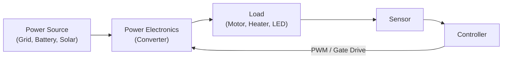

# 06 — Power Electronics

> *Power electronics is the art of converting electrical energy from one form to another efficiently. Every motor drive, power supply, solar inverter, and battery charger relies on power electronic circuits.*

---

## 6.1 Why Power Electronics?

Control systems need **power** to actuate. The controller decides *what* to do; power electronics delivers *how much energy* to do it.



### Power Conversion Types

| Conversion | Name | Example |
|---|---|---|
| AC → DC | Rectifier | Phone charger, DC motor drive |
| DC → DC | Chopper/Converter | Buck, boost, battery management |
| DC → AC | Inverter | Solar grid-tie, motor VFD |
| AC → AC | Cycloconverter | Industrial frequency conversion |

---

## 6.2 Rectifiers

### Half-Wave Rectifier

```
  V_in (AC) ──── D ────┬──── V_out (DC)
                        │
                        R_load
                        │
                       GND
```

$$V_{out,avg} = \frac{V_m}{\pi} \approx 0.318 \cdot V_m$$

Efficiency: ~40.5% — wastes half the input cycle.

### Full-Bridge Rectifier

```
         D1        D3
  AC ──┬──►──┬──►──┬── V_out (+)
       │     │     │
       │   LOAD    │
       │     │     │
  AC ──┴──◄──┴──◄──┴── V_out (−)
         D2        D4
```

$$V_{out,avg} = \frac{2V_m}{\pi} \approx 0.636 \cdot V_m$$

See: [examples/full-bridge-rectifier.md](examples/full-bridge-rectifier.md)

---

## 6.3 DC-DC Converters

### Buck Converter (Step-Down)

The most common DC-DC topology in electronics.

```
  V_in ──┬── SW ──┬── L ──┬── V_out
         │        │       │
         │        D       C    R_load
         │        │       │
        GND ──────┴───────┴── GND
```

**Fundamental equation** (Continuous Conduction Mode):

$$\boxed{V_{out} = D \cdot V_{in}}$$

Where $D = t_{on} / T_{sw}$ is the duty cycle ($0 \leq D \leq 1$).

### Boost Converter (Step-Up)

```
  V_in ──── L ──┬── D ──┬── V_out
                │       │
                SW      C    R_load
                │       │
               GND ─────┴── GND
```

$$\boxed{V_{out} = \frac{V_{in}}{1 - D}}$$

### Buck-Boost Converter (Inverting)

$$\boxed{V_{out} = -\frac{D}{1-D} \cdot V_{in}}$$

### Comparison

| Topology | Output Range | Output Polarity | Complexity | Efficiency |
|---|---|---|---|---|
| Buck | $0 < V_{out} < V_{in}$ | Same | Low | 90–97% |
| Boost | $V_{out} > V_{in}$ | Same | Low | 85–95% |
| Buck-Boost | Any | Inverted | Medium | 80–92% |
| SEPIC | Any | Same | Higher | 80–90% |

See: [examples/buck-converter-analysis.md](examples/buck-converter-analysis.md)

---

## 6.4 Pulse Width Modulation (PWM)

PWM is the primary control method for power converters.

```
  PWM Signal at D = 60%:
  
  V_high │████████████░░░░░░░░│████████████░░░░░░░░│
         │   t_on     t_off  │   t_on     t_off  │
  V_low  │            │      │            │      │
         └──────────────────────────────────────────→ t
         │◄──── T_sw ────►│
         
  Average: V_avg = D × V_high = 0.6 × V_high
```

### PWM Frequency Selection

| Application | Typical $f_{sw}$ | Reason |
|---|---|---|
| Motor drive | 5–20 kHz | Above audible range |
| LED driver | 1–200 kHz | Avoid visible flicker |
| Buck converter | 100 kHz–2 MHz | Small inductor/capacitor |
| Audio amplifier | >200 kHz | Well above audio band |

See: [examples/pwm-control.py](examples/pwm-control.py)

---

## 6.5 Switching Devices

| Device | Voltage | Current | Speed | Gate Drive | Best For |
|---|---|---|---|---|---|
| MOSFET | <600V | <100A | Very fast | Voltage | Low-V, high-freq converters |
| IGBT | 600V–6.5kV | <3600A | Medium | Voltage | High-power motor drives |
| SiC MOSFET | <1700V | <100A | Fastest | Voltage | High-V, high-freq, high-temp |
| GaN HEMT | <650V | <60A | Fastest | Voltage | Very high-freq converters |
| Diode (Si) | Any | Any | Medium | N/A | Rectification |
| Schottky | <200V | <30A | Very fast | N/A | Low-V rectification |

💡 **Insight**: Wide-bandgap semiconductors (SiC, GaN) are revolutionizing power electronics by enabling higher switching frequencies and lower losses, leading to smaller, lighter converters.

---

## 6.6 Efficiency and Loss Analysis

$$\eta = \frac{P_{out}}{P_{in}} = \frac{P_{out}}{P_{out} + P_{losses}}$$

### Loss Components

$$P_{total} = P_{conduction} + P_{switching} + P_{gate} + P_{inductor} + P_{capacitor}$$

**Conduction losses** (MOSFET):
$$P_{cond} = I_{rms}^2 \cdot R_{DS,on}$$

**Switching losses**:
$$P_{sw} = \frac{1}{2} V_{DS} \cdot I_D \cdot (t_{rise} + t_{fall}) \cdot f_{sw}$$

**Trade-off**: Higher $f_{sw}$ → smaller L and C (cheaper, lighter) but more switching losses.

---

## 6.7 Thermal Considerations

```
  T_junction ──── R_th,JC ──── T_case ──── R_th,CS ──── T_sink ──── R_th,SA ──── T_ambient
  
  R_th,JC: Junction-to-case (device property)
  R_th,CS: Case-to-sink (thermal paste/pad)
  R_th,SA: Sink-to-ambient (heat sink property)
```

$$T_J = T_A + P_{loss} \cdot (R_{th,JC} + R_{th,CS} + R_{th,SA})$$

$$T_J \leq T_{J,max}$$ (typically 125°C or 150°C)

See: [examples/thermal-design.md](examples/thermal-design.md)

---

## Examples

| File | Description |
|---|---|
| [buck-converter-analysis.md](examples/buck-converter-analysis.md) | Complete buck converter design |
| [pwm-control.py](examples/pwm-control.py) | PWM generation and motor speed control |
| [full-bridge-rectifier.md](examples/full-bridge-rectifier.md) | Rectifier analysis with filter |
| [thermal-design.md](examples/thermal-design.md) | Thermal management methodology |

---

**Previous → [05-digital-electronics](../05-digital-electronics/README.md)**  
**Next → [07-sensors-and-actuators](../07-sensors-and-actuators/README.md)**
