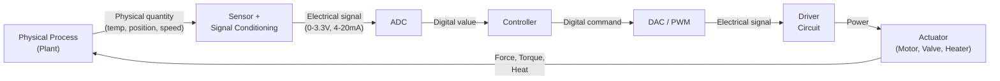

# 07 — Sensors and Actuators

> *Sensors are the eyes and ears of a control system; actuators are its muscles. Together, they bridge the gap between the physical world and the digital controller.*

---

## 7.1 The Control Loop Interface



---

## 7.2 Sensor Classification

### By Measurement Principle

| Category | Sensor | Physical Quantity | Output |
|---|---|---|---|
| **Resistive** | RTD, Thermistor, Strain gauge | Temp, Force | ΔR |
| **Capacitive** | Proximity, Humidity | Distance, RH | ΔC |
| **Inductive** | LVDT, Resolver | Position, Angle | ΔL / V_ac |
| **Piezoelectric** | Accelerometer, Force | Vibration, Force | Charge/V |
| **Optical** | Encoder, Photodiode | Position, Light | Pulses / I |
| **Electromagnetic** | Hall effect, GMR | B-field, Current | V |
| **Thermoelectric** | Thermocouple | Temperature | mV |

### By Output Type

| Type | Signal | Example | Range |
|---|---|---|---|
| Analog voltage | 0–5V, 0–10V | Potentiometer | Short cable runs |
| Analog current | 4–20 mA | Industrial transmitter | Long cable, noise immune |
| Digital pulse | Frequency / PWM | Encoder, flow meter | Noise immune |
| Digital serial | I²C, SPI, UART | IMU, temp sensor IC | Integrated sensors |

💡 **Insight**: The 4–20 mA standard is dominant in industry because: (1) current signals are immune to cable resistance, (2) 4 mA ≠ 0 mA allows broken-wire detection, (3) the signal powers the sensor via 2-wire loop.

---

## 7.3 Sensor Characteristics

### Static Characteristics

| Parameter | Definition | Example |
|---|---|---|
| **Range** | Min to max measurable value | 0–100°C |
| **Sensitivity** | Output change per input change | 10 mV/°C |
| **Linearity** | Max deviation from best-fit line | ±0.5% FS |
| **Accuracy** | Closeness to true value | ±1°C |
| **Precision** | Repeatability of measurements | ±0.1°C |
| **Resolution** | Smallest detectable change | 0.01°C |
| **Hysteresis** | Different reading up vs. down | ±0.2% FS |
| **Offset** | Non-zero output at zero input | ±5 mV |
| **Drift** | Change over time / temperature | 0.1%/year |

### Dynamic Characteristics

Most sensors can be modeled as first- or second-order systems:

**First-order** (thermocouple, RTD):
$$G(s) = \frac{K}{1 + \tau s}$$

**Second-order** (accelerometer, pressure sensor):
$$G(s) = \frac{K \omega_n^2}{s^2 + 2\zeta\omega_n s + \omega_n^2}$$

⚠️ **Pitfall**: A sensor may have excellent static accuracy but poor dynamic response. A thermocouple with ±0.5°C accuracy may have a 5-second time constant — useless for fast temperature control loops.

---

## 7.4 Signal Conditioning

```
  Sensor ──► Amplifier ──► Filter ──► Level Shift ──► ADC
             (gain)        (anti-      (0-V_ref)
                           aliasing)
```

### Wheatstone Bridge (for resistive sensors)

```
         V_excitation
             │
        ┌────┼────┐
        │         │
        R1        R2
        │         │
        ├── V+ ── ├── V−
        │         │
        R3      R_sensor
        │         │
        └────┴────┘
            GND
```

$$V_{out} = V_{exc} \left( \frac{R_sensor}{R_3 + R_{sensor}} - \frac{R_2}{R_1 + R_2} \right)$$

See: [examples/sensor-calibration.md](examples/sensor-calibration.md)

---

## 7.5 Common Actuators

### DC Motors

| Type | Torque | Speed Control | Precision | Application |
|---|---|---|---|---|
| Brushed DC | Moderate | PWM (simple) | Low | Toys, fans, pumps |
| Brushless DC (BLDC) | High | ESC/FOC | Medium | Drones, EV, tools |
| Stepper | Low-Medium | Open-loop positioning | High | 3D printers, CNC |
| Servo (RC) | Low | PWM position signal | Medium | Robotics, RC |

**DC motor equations:**

$$V = L\frac{di}{dt} + Ri + K_b\omega \qquad \qquad \tau = K_t \cdot i$$

$$J\frac{d\omega}{dt} = K_t \cdot i - B\omega - \tau_{load}$$

### Other Actuators

| Actuator | Output | Speed | Force | Precision |
|---|---|---|---|---|
| Solenoid | Linear, on/off | Fast | Low-Med | Binary |
| Pneumatic cylinder | Linear | Fast | High | Low |
| Hydraulic cylinder | Linear | Medium | Very high | Medium |
| Piezo actuator | Linear (μm) | Very fast | Low | Sub-nm |
| Heating element | Thermal | Slow | N/A | Medium |
| Voice coil | Linear | Very fast | Low | High |

See: [examples/motor-driver-circuit.md](examples/motor-driver-circuit.md)

---

## 7.6 Temperature Sensing

| Sensor | Range | Accuracy | Response | Output | Cost |
|---|---|---|---|---|---|
| Thermocouple | −200 to 1800°C | ±1–2°C | Fast | mV | Low |
| RTD (Pt100) | −200 to 850°C | ±0.1°C | Slow | ΔR | Medium |
| Thermistor (NTC) | −40 to 300°C | ±0.2°C | Medium | ΔR (nonlinear) | Low |
| IC sensor (LM35) | −55 to 150°C | ±0.5°C | Medium | 10mV/°C | Low |
| Infrared (pyrometer) | −70 to 3000°C | ±1–2% | Fast | V | High |

See: [examples/thermocouple-interface.md](examples/thermocouple-interface.md)

---

## 7.7 Position and Speed Sensing

### Incremental Encoder

```
  Channel A: ─┐ ┌─┐ ┌─┐ ┌─┐ ┌─┐ ┌─
               └─┘ └─┘ └─┘ └─┘ └─┘
               
  Channel B:  ─┐ ┌─┐ ┌─┐ ┌─┐ ┌─┐ ┌─
                └─┘ └─┘ └─┘ └─┘ └─┘
                  
  Index Z:  ──────────────┐ ┌────────
                          └─┘
  
  Direction: A leads B → CW, B leads A → CCW
  Resolution: 4× decoding → 4 × PPR counts per revolution
```

See: [examples/encoder-reading.md](examples/encoder-reading.md)

---

## Examples

| File | Description |
|---|---|
| [sensor-calibration.md](examples/sensor-calibration.md) | Multi-point calibration methodology |
| [motor-driver-circuit.md](examples/motor-driver-circuit.md) | H-bridge motor driver design |
| [thermocouple-interface.md](examples/thermocouple-interface.md) | Type-K thermocouple with cold-junction compensation |
| [encoder-reading.md](examples/encoder-reading.md) | Quadrature encoder decoding |

---

**Previous → [06-power-electronics](../06-power-electronics/README.md)**  
**Next → [08-feedback-control-theory](../08-feedback-control-theory/README.md)**
