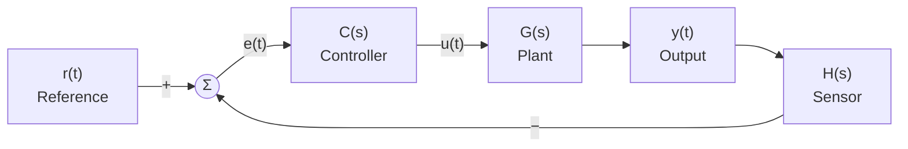
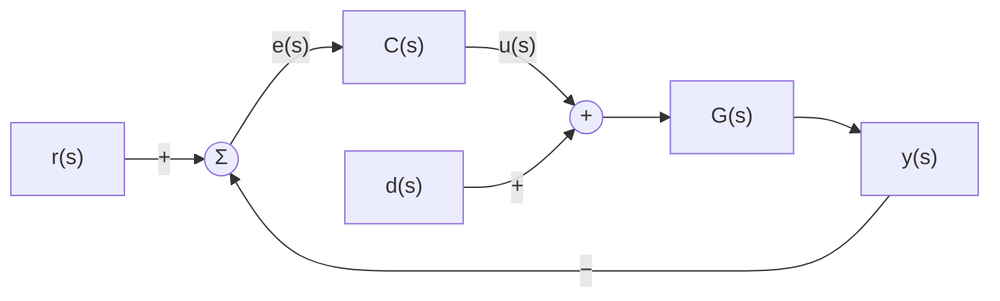

# 08 — Feedback Control Theory

> *Feedback is the single most powerful idea in control engineering. By measuring the output and comparing it to the desired value, we can make systems behave in ways that would be impossible with open-loop control alone.*

---

## 8.1 The Feedback Principle



### Key Signals

| Symbol | Name | Description |
|---|---|---|
| $r(t)$ | Reference / Setpoint | Desired output value |
| $e(t) = r(t) - y_m(t)$ | Error | Difference between desired and measured |
| $u(t)$ | Control signal | Output of controller, input to plant |
| $y(t)$ | Plant output | Actual process variable |
| $y_m(t) = H(s) \cdot y(t)$ | Measured output | Sensor reading |
| $d(t)$ | Disturbance | Unwanted input acting on plant |
| $n(t)$ | Noise | Sensor measurement noise |

---

## 8.2 Closed-Loop Transfer Function

For unity feedback ($H(s) = 1$):

### Reference to Output

$$\boxed{T(s) = \frac{Y(s)}{R(s)} = \frac{C(s)G(s)}{1 + C(s)G(s)} = \frac{L(s)}{1 + L(s)}}$$

Where $L(s) = C(s)G(s)$ is the **loop transfer function** (open-loop gain).

### Error Transfer Function

$$\boxed{E(s) = \frac{R(s) - Y(s)}{R(s)} = \frac{1}{1 + L(s)} = S(s)}$$

$S(s)$ is the **sensitivity function** — the most important transfer function in control.

### Disturbance to Output

$$\frac{Y(s)}{D(s)} = \frac{G_d(s)}{1 + L(s)}$$

Feedback attenuates disturbances by the factor $\frac{1}{1 + L(s)}$.

### Noise to Output

$$\frac{Y(s)}{N(s)} = \frac{-T(s)}{1} = \frac{-L(s)}{1 + L(s)}$$

⚠️ **Pitfall**: Feedback reduces disturbance sensitivity but amplifies sensor noise at high frequencies where $|L(j\omega)|$ is small. This is a fundamental trade-off.

---

## 8.3 Benefits of Feedback

| Benefit | Mechanism | Mathematical Basis |
|---|---|---|
| Disturbance rejection | Loop gain attenuates disturbances | $Y/D = G_d/(1+L)$ |
| Reduced sensitivity to plant variations | High loop gain makes $T \approx 1/H$ | $S = 1/(1+L)$ |
| Bandwidth extension | Controller adds gain at higher frequencies | $\omega_{BW,CL} > \omega_{BW,OL}$ |
| Stabilization | Feedback can stabilize unstable plants | Pole placement |
| Steady-state accuracy | Integral action eliminates DC error | $S(0) = 0$ with integrator |

### The Sensitivity Trade-off

$$\boxed{S(s) + T(s) = 1}$$

Where $S(s) = \frac{1}{1+L(s)}$ (sensitivity) and $T(s) = \frac{L(s)}{1+L(s)}$ (complementary sensitivity).

This means: you **cannot** have both perfect tracking ($T = 1$) and perfect noise rejection ($T = 0$) at the same frequency.

---

## 8.4 Stability

### Necessary Condition
All closed-loop poles must have negative real parts (lie in the left-half s-plane).

### Characteristic Equation
$$1 + L(s) = 0 \quad \Rightarrow \quad 1 + C(s)G(s) = 0$$

### BIBO Stability
A system is Bounded-Input Bounded-Output (BIBO) stable if every bounded input produces a bounded output.

### Stability Margins

**Gain Margin (GM)**: How much loop gain can increase before instability.

$$GM = \frac{1}{|L(j\omega_\pi)|} \quad \text{where } \angle L(j\omega_\pi) = -180°$$

**Phase Margin (PM)**: How much additional phase lag is tolerable.

$$PM = 180° + \angle L(j\omega_c) \quad \text{where } |L(j\omega_c)| = 1 \;(0\;\text{dB})$$

```
  Bode Plot:
  
  |L(jω)| dB
    40 │╲
    20 │  ╲
     0 │────╳──────── ω_c (gain crossover)
   -20 │      ╲
       └──────────────► ω
       
  ∠L(jω)
     0°│
   -90°│    ╲
  -180°│──────╳────── ω_π (phase crossover)
  -270°│        ╲
       └──────────────► ω
       
  GM = −|L(jω_π)| dB (should be > 6 dB)
  PM = 180° + ∠L(jω_c) (should be 30°–60°)
```

### Recommended Margins

| Application | Gain Margin | Phase Margin |
|---|---|---|
| Minimum (any system) | > 6 dB | > 30° |
| Typical industrial | > 10 dB | 45°–60° |
| Safety-critical | > 12 dB | > 60° |
| Aggressive (fast response) | 6–8 dB | 30°–45° |

See: [examples/sensitivity-analysis.md](examples/sensitivity-analysis.md)

---

## 8.5 Steady-State Error

For a unity-feedback system with loop transfer function $L(s)$:

### System Type

The **type number** = number of free integrators in $L(s)$.

$$L(s) = \frac{K \cdot (\text{zeros})}{s^N \cdot (\text{poles})}$$

Type $N$ = number of $s$ factors in denominator.

### Steady-State Error Table

| Input | Step ($1/s$) | Ramp ($1/s^2$) | Parabola ($1/s^3$) |
|---|---|---|---|
| Type 0 | $\frac{1}{1+K_p}$ | $\infty$ | $\infty$ |
| Type 1 | $0$ | $\frac{1}{K_v}$ | $\infty$ |
| Type 2 | $0$ | $0$ | $\frac{1}{K_a}$ |

**Error constants:**

$$K_p = \lim_{s \to 0} L(s), \quad K_v = \lim_{s \to 0} sL(s), \quad K_a = \lim_{s \to 0} s^2 L(s)$$

💡 **Insight**: Adding an integrator ($1/s$) to the controller increases the system type by 1, eliminating steady-state error to the next class of inputs — but it also adds 90° phase lag, reducing stability margins.

---

## 8.6 PID Control

The most widely used controller structure in industry (~95% of all feedback controllers):

$$C(s) = K_p + \frac{K_i}{s} + K_d s = K_p \left(1 + \frac{1}{T_i s} + T_d s\right)$$

| Term | Action | Effect | Cost |
|---|---|---|---|
| $K_p$ (Proportional) | Amplifies error | Faster response, reduces SS error | May oscillate |
| $K_i / s$ (Integral) | Accumulates error | Eliminates SS error | Slower, may oscillate |
| $K_d s$ (Derivative) | Responds to rate of change | Faster settling, damping | Noise amplification |

See: [examples/feedback-loop-diagram.md](examples/feedback-loop-diagram.md)

---

## 8.7 Disturbance Rejection



$$Y(s) = \underbrace{\frac{C(s)G(s)}{1+C(s)G(s)}}_{T(s)} R(s) + \underbrace{\frac{G(s)}{1+C(s)G(s)}}_{S(s)G(s)} D(s)$$

The disturbance is attenuated by the factor $\frac{1}{1+L(s)}$ — which is small where $|L(j\omega)|$ is large (low frequencies, typically).

See: [examples/disturbance-rejection.md](examples/disturbance-rejection.md)

---

## Examples

| File | Description |
|---|---|
| [feedback-loop-diagram.md](examples/feedback-loop-diagram.md) | PID controller design walkthrough |
| [sensitivity-analysis.md](examples/sensitivity-analysis.md) | Sensitivity and complementary sensitivity |
| [disturbance-rejection.md](examples/disturbance-rejection.md) | Load disturbance analysis and feedforward |

---

**Previous → [07-sensors-and-actuators](../07-sensors-and-actuators/README.md)**  
**Next → [09-classical-control-methods](../09-classical-control-methods/README.md)**
