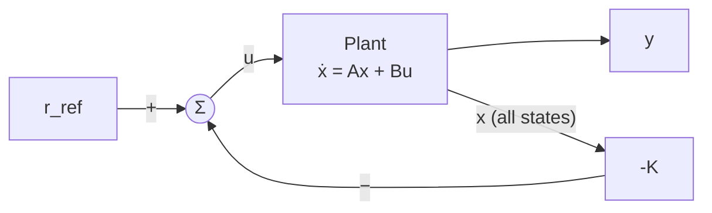
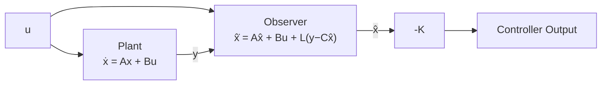

# 10 — Modern Control Theory (State-Space Methods)

> *Modern control theory works directly with systems of first-order differential equations in the time domain. This state-space approach naturally handles MIMO systems, provides deep structural insight through controllability and observability, and enables optimal control design.*

---

## 10.1 State-Space Representation

Any LTI system can be written as:

$$\boxed{\dot{x}(t) = Ax(t) + Bu(t)}$$
$$\boxed{y(t) = Cx(t) + Du(t)}$$

Where:
- $x \in \mathbb{R}^n$: state vector
- $u \in \mathbb{R}^m$: input vector
- $y \in \mathbb{R}^p$: output vector
- $A \in \mathbb{R}^{n \times n}$: system matrix (dynamics)
- $B \in \mathbb{R}^{n \times m}$: input matrix
- $C \in \mathbb{R}^{p \times n}$: output matrix
- $D \in \mathbb{R}^{p \times m}$: feedthrough matrix (often zero)

### Transfer Function Connection

$$G(s) = C(sI - A)^{-1}B + D$$

Poles of $G(s)$ = eigenvalues of $A$.

---

## 10.2 Solution of the State Equation

$$x(t) = e^{At}x(0) + \int_0^t e^{A(t-\tau)}Bu(\tau) \, d\tau$$

**Matrix exponential**: $e^{At} = \mathcal{L}^{-1}\{(sI-A)^{-1}\} = I + At + \frac{(At)^2}{2!} + \cdots$

---

## 10.3 Stability from Eigenvalues

The system is stable if and only if all eigenvalues of $A$ have negative real parts:

$$\lambda_i = \text{eig}(A), \quad \text{Re}(\lambda_i) < 0 \;\; \forall i$$

```
  Eigenvalue Map:
  
  Im(λ)
    │  ×       
    │    ×     ← unstable (Re > 0)
  ──┼──────────── Re(λ)
    │  ×       
    │    
    
  Left half: stable    Right half: unstable
```

---

## 10.4 Controllability

A system is **controllable** if any state can be reached from any other state by applying an appropriate input.

### Controllability Matrix

$$\mathcal{C} = \begin{bmatrix} B & AB & A^2B & \cdots & A^{n-1}B \end{bmatrix}$$

$$\boxed{\text{System is controllable} \iff \text{rank}(\mathcal{C}) = n}$$

💡 **Insight**: Controllability means every mode (eigenvalue) can be influenced by the input. If a mode is uncontrollable, no controller can move that pole — it is fixed regardless of feedback.

---

## 10.5 Observability

A system is **observable** if the initial state can be determined from the output history.

### Observability Matrix

$$\mathcal{O} = \begin{bmatrix} C \\ CA \\ CA^2 \\ \vdots \\ CA^{n-1} \end{bmatrix}$$

$$\boxed{\text{System is observable} \iff \text{rank}(\mathcal{O}) = n}$$

### Duality

Controllability of $(A, B)$ ↔ Observability of $(A^T, B^T)$

---

## 10.6 State Feedback and Pole Placement

### Full-State Feedback

$$u = -Kx + r_{ref}$$



Closed-loop system:

$$\dot{x} = (A - BK)x + Br_{ref}$$

The eigenvalues of $(A - BK)$ are the closed-loop poles.

### Pole Placement Theorem (Ackermann)

If the system is **controllable**, then $K$ can be chosen to place the eigenvalues of $(A-BK)$ at any desired locations.

$$K = \begin{bmatrix} 0 & \cdots & 0 & 1 \end{bmatrix} \mathcal{C}^{-1} \cdot \alpha_c(A)$$

Where $\alpha_c(s) = \prod(s - p_i^{desired})$ is the desired characteristic polynomial evaluated at $A$.

See: [examples/pole-placement.py](examples/pole-placement.py)

---

## 10.7 Observer Design

When not all states are measurable (which is typical), we estimate them:

### Full-Order Luenberger Observer

$$\dot{\hat{x}} = A\hat{x} + Bu + L(y - C\hat{x})$$



Estimation error: $\tilde{x} = x - \hat{x}$

$$\dot{\tilde{x}} = (A - LC)\tilde{x}$$

Observer poles = eigenvalues of $(A - LC)$.

### Design Rule
Observer poles should be 2–6× faster than controller poles (so estimation error decays before it affects control).

---

## 10.8 Separation Principle

The controller gain $K$ and observer gain $L$ can be designed **independently**:

1. Design $K$ assuming full-state feedback (ignoring observer)
2. Design $L$ for the observer (ignoring the controller)
3. The combined system has poles at: eigenvalues of $(A-BK)$ ∪ eigenvalues of $(A-LC)$

This only holds for LTI systems!

---

## 10.9 Canonical Forms

| Form | A Matrix Structure | Use |
|---|---|---|
| Controllable canonical | Companion matrix | Controller design |
| Observable canonical | Transposed companion | Observer design |
| Diagonal (modal) | Diagonal (if eigenvalues real) | Physical insight |
| Jordan | Block diagonal | Repeated eigenvalues |

---

## Examples

| File | Description |
|---|---|
| [pole-placement.py](examples/pole-placement.py) | State-feedback pole placement with simulation |
| [controllability-observability.md](examples/controllability-observability.md) | Checking structural properties |
| [observer-design.py](examples/observer-design.py) | Luenberger observer with estimation error plots |

---

**Previous → [09-classical-control-methods](../09-classical-control-methods/README.md)**  
**Next → [11-digital-control-systems](../11-digital-control-systems/README.md)**
