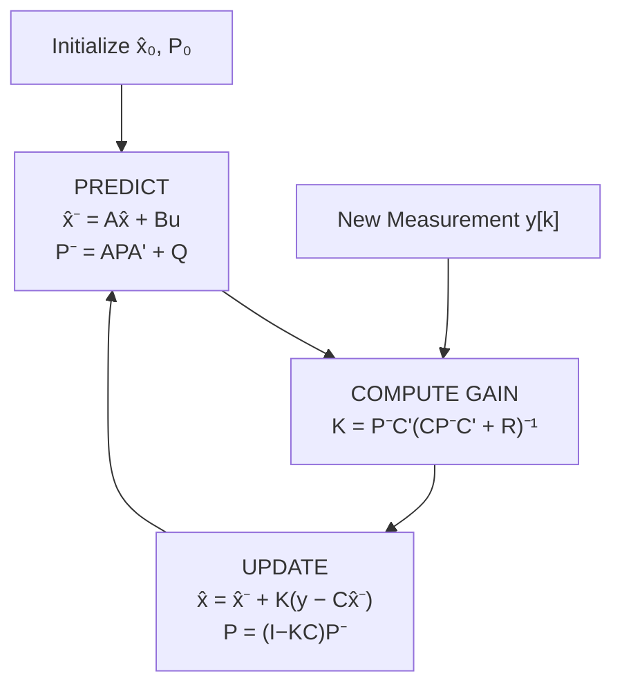

# 12 — State Estimation and Kalman Filter

> *In real systems, we rarely have access to all states. The Kalman filter is the optimal linear state estimator that fuses noisy measurements with a dynamic model to produce the best possible estimate of the system state.*

---

## 12.1 The Estimation Problem

```
  True system:  x[k+1] = A x[k] + B u[k] + w[k]    (process noise)
  Measurement:  y[k]   = C x[k] + v[k]              (measurement noise)
  
  w[k] ~ N(0, Q)   process noise covariance
  v[k] ~ N(0, R)   measurement noise covariance
```

**Goal**: Find the best estimate $\hat{x}[k]$ given all measurements $y[0], y[1], \ldots, y[k]$.

---

## 12.2 Kalman Filter Algorithm

### Predict Step (Time Update)

$$\hat{x}[k|k-1] = A\hat{x}[k-1|k-1] + Bu[k-1]$$
$$P[k|k-1] = AP[k-1|k-1]A^T + Q$$

### Update Step (Measurement Update)

$$K[k] = P[k|k-1]C^T(CP[k|k-1]C^T + R)^{-1}$$
$$\hat{x}[k|k] = \hat{x}[k|k-1] + K[k](y[k] - C\hat{x}[k|k-1])$$
$$P[k|k] = (I - K[k]C)P[k|k-1]$$

Where:
- $K[k]$: **Kalman gain** — balances trust in model vs. measurement
- $P[k|k]$: estimation error covariance
- $y[k] - C\hat{x}[k|k-1]$: **innovation** (measurement residual)



---

## 12.3 Intuition Behind the Kalman Gain

$$K = \frac{\text{model uncertainty}}{\text{model uncertainty} + \text{measurement uncertainty}} = \frac{P^-C^T}{CP^-C^T + R}$$

| Scenario | $K$ | Behavior |
|---|---|---|
| $R \to 0$ (perfect sensor) | $K \to C^{-1}$ | Trust measurement completely |
| $R \to \infty$ (terrible sensor) | $K \to 0$ | Ignore measurement, trust model |
| $Q$ large (uncertain model) | $K$ large | Rely more on measurements |
| $Q \to 0$ (perfect model) | $K \to 0$ | Trust model, ignore measurements |

💡 **Insight**: The Kalman filter is a principled way to "blend" model predictions with measurements. It is optimal (minimum variance) under Gaussian noise assumptions.

---

## 12.4 Steady-State Kalman Filter

After many iterations, $P$ and $K$ converge to steady-state values. The steady-state Kalman filter is a constant-gain observer:

$$\hat{x}[k|k] = (A - AK_{ss}C)\hat{x}[k-1|k-1] + Bu[k-1] + AK_{ss}y[k]$$

This is equivalent to a Luenberger observer with optimally chosen gain $L = AK_{ss}$.

---

## 12.5 Extended Kalman Filter (EKF)

For nonlinear systems:

$$x[k+1] = f(x[k], u[k]) + w[k]$$
$$y[k] = h(x[k]) + v[k]$$

The EKF linearizes at each step:

$$A[k] = \frac{\partial f}{\partial x}\bigg|_{\hat{x}[k]}, \quad C[k] = \frac{\partial h}{\partial x}\bigg|_{\hat{x}[k]}$$

Then applies the standard Kalman equations with time-varying $A[k]$ and $C[k]$.

⚠️ **Pitfall**: The EKF can diverge if the system is highly nonlinear, the initial estimate is far from truth, or the linearization is poor. The Unscented Kalman Filter (UKF) handles moderate nonlinearities better.

---

## 12.6 Sensor Fusion

The Kalman filter naturally fuses multiple sensors with different characteristics:

```
  GPS (1 Hz, accurate long-term)     ──►┐
  Accelerometer (1000 Hz, drifts)     ──►├──► Kalman ──► Best estimate
  Gyroscope (1000 Hz, drifts)         ──►│    Filter     of position,
  Barometer (10 Hz, weather-dependent)──►┘               velocity,
                                                         attitude
```

Each sensor contributes based on its noise characteristics (reflected in $R$).

---

## Examples

| File | Description |
|---|---|
| [kalman-1d-temperature.py](examples/kalman-1d-temperature.py) | Simple 1D Kalman filter for noisy temperature |
| [kalman-tracking.py](examples/kalman-tracking.py) | 2D position/velocity tracking |
| [sensor-fusion.md](examples/sensor-fusion.md) | IMU + GPS fusion overview |

---

**Previous → [11-digital-control-systems](../11-digital-control-systems/README.md)**  
**Next → [13-nonlinear-and-adaptive-control](../13-nonlinear-and-adaptive-control/README.md)**
