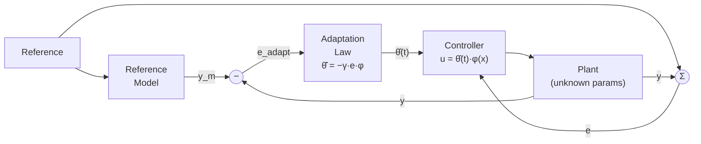

# 13 — Nonlinear and Adaptive Control

> *Most real systems are nonlinear. While linear control handles many applications through linearization, truly nonlinear phenomena — saturation, dead zones, friction, limit cycles — require specialized analysis and control techniques.*

---

## 13.1 Sources of Nonlinearity

| Nonlinearity | Description | Example |
|---|---|---|
| **Saturation** | Output clamps at a limit | Amplifier clipping, valve fully open |
| **Dead zone** | No output for small inputs | Gear backlash, stiction |
| **Hysteresis** | Output depends on history | Magnetic materials, relays |
| **Coulomb friction** | Constant opposing force | Bearing friction |
| **Backlash** | Lost motion in gears | Gear trains |
| **Quantization** | Discrete levels | ADC, stepper motors |
| **Square-law** | Output ∝ input² | Fluid flow, aerodynamic drag |
| **Bilinear** | Product of two variables | Heat exchangers |

---

## 13.2 Phase Plane Analysis

For second-order systems $\ddot{x} = f(x, \dot{x})$, the phase portrait plots $\dot{x}$ vs. $x$:

```
  ẋ (velocity)
   │     ╲  ╱
   │      ╲╱  ← stable focus (spiral inward)
  ─┼──────╳────── x (position)
   │      ╱╲
   │     ╱  ╲
   
  ẋ
   │   →→→→→→
   │  ╱──────╲
  ─┼─╱────────╲── x
   │  ╲──────╱    ← limit cycle
   │   ←←←←←←
```

### Equilibrium Point Classification

| Type | Eigenvalues | Phase Portrait |
|---|---|---|
| Stable node | Both real, negative | Converging straight lines |
| Unstable node | Both real, positive | Diverging straight lines |
| Saddle point | Real, opposite signs | Hyperbolic trajectories |
| Stable focus | Complex, negative real | Inward spiral |
| Unstable focus | Complex, positive real | Outward spiral |
| Center | Purely imaginary | Closed orbits |

---

## 13.3 Lyapunov Stability Theory

The most powerful tool for analyzing nonlinear stability without solving the differential equation.

### Lyapunov's Direct Method

If there exists a scalar function $V(x)$ (candidate Lyapunov function) such that:

1. $V(0) = 0$
2. $V(x) > 0 \quad \forall x \neq 0$ (positive definite)
3. $\dot{V}(x) \leq 0 \quad \forall x$ (negative semi-definite)

Then the equilibrium $x = 0$ is **stable**.

If additionally $\dot{V}(x) < 0 \quad \forall x \neq 0$, the equilibrium is **asymptotically stable**.

$$\dot{V}(x) = \frac{\partial V}{\partial x} \cdot f(x) = \nabla V \cdot f(x)$$

### Common Lyapunov Candidates

- **Energy-based**: $V = \frac{1}{2}m\dot{x}^2 + \frac{1}{2}kx^2$ (kinetic + potential)
- **Quadratic**: $V = x^T P x$ where $P > 0$ (for linear systems: $A^T P + PA = -Q$)

See: [examples/lyapunov-analysis.md](examples/lyapunov-analysis.md)

---

## 13.4 Describing Functions

An approximate frequency-domain method for analyzing nonlinear systems with a single nonlinear element.

**Idea**: Replace the nonlinearity with its "equivalent gain" at the fundamental frequency when driven by a sinusoidal input.

$$N(A) = \frac{Y_1}{A} e^{j\phi_1}$$

Where $A$ is the input amplitude and $Y_1, \phi_1$ are the fundamental component of the output.

### Limit Cycle Prediction

A limit cycle exists where:

$$G(j\omega) = \frac{-1}{N(A)}$$

This is checked graphically by plotting $G(j\omega)$ and $-1/N(A)$ on the Nyquist plane.

---

## 13.5 Feedback Linearization

Transform a nonlinear system into a linear one using nonlinear feedback:

**Input-output linearization** for $\dot{x} = f(x) + g(x)u$, $y = h(x)$:

$$u = \frac{1}{L_g L_f^{r-1} h(x)} \left(v - L_f^r h(x)\right)$$

Where $L_f h$ is the Lie derivative and $r$ is the relative degree.

Result: $y^{(r)} = v$ (chain of integrators — linear!)

⚠️ **Pitfall**: Feedback linearization requires an exact plant model. Model errors can destabilize the system, especially at high gains. It's best combined with robust outer-loop control.

---

## 13.6 Adaptive Control

When plant parameters are unknown or time-varying, the controller must adapt.

### Model Reference Adaptive Control (MRAC)



The adaptation law adjusts controller parameters $\hat{\theta}(t)$ to minimize the tracking error:

$$\dot{\hat{\theta}} = -\gamma \cdot e \cdot \phi(x)$$

(MIT rule, based on gradient descent)

See: [examples/adaptive-control.py](examples/adaptive-control.py)

---

## 13.7 Gain Scheduling

A practical approach for systems whose dynamics change with operating point:

1. Linearize the plant at multiple operating points
2. Design a controller for each operating point
3. Schedule (interpolate) controller gains based on the current operating point

```
  Operating Point:  ──────────────────────────────►
  (e.g., speed)     Low        Medium        High
  
  Controller:       C₁(s)      C₂(s)        C₃(s)
  Kp:               2.0        3.5           5.0
  Ki:               10         15            20
  Kd:               0.01       0.02          0.03
```

🔧 **Practical**: Gain scheduling is by far the most common nonlinear control approach in industry (automotive, aerospace, process control). It works well when the operating point changes slowly relative to the control dynamics.

---

## Examples

| File | Description |
|---|---|
| [lyapunov-analysis.md](examples/lyapunov-analysis.md) | Lyapunov stability proof for pendulum |
| [adaptive-control.py](examples/adaptive-control.py) | MRAC for unknown plant gain |
| [gain-scheduling.md](examples/gain-scheduling.md) | Gain-scheduled PID design |

---

**Previous → [12-state-estimation](../12-state-estimation/README.md)**  
**Next → [14-robust-and-optimal-control](../14-robust-and-optimal-control/README.md)**
